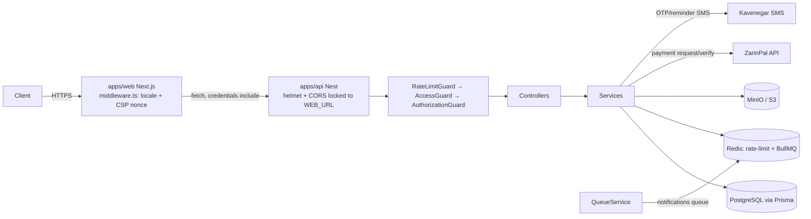

# Phase 0 — Map

## Architecture correction

This audit prompt was written for a `gateway`/`services`/`workers` NestJS microservices monorepo on MongoDB + NATS/JetStream + `@wenex/sdk`. This repo does not have that shape. Verified facts:

- npm workspaces: `@lingospeak/web` (`apps/web`, Next.js 15 / React 19), `@lingospeak/api` (`apps/api`, NestJS 11), `@lingospeak/contracts` (`packages/contracts`, shared Zod schemas).
- Database: PostgreSQL via Prisma (`apps/api/prisma/schema.prisma`), not MongoDB. No replica-set, no Mongoose.
- Messaging: no NATS/JetStream, no saga pattern anywhere in the repo (`grep -r nats\|jetstream` → no hits outside this audit's own text).
- Background jobs: BullMQ (real dependency, `bullmq@5.40.3`), but running inline inside `apps/api/src/modules/queue/queue.service.ts` (one `Queue`/`Worker` pair, `'notifications'`), not a separate `workers` app.
- Payments: ZarinPal (real, Iranian gateway) — `apps/api/src/modules/commerce/gateway.service.ts`. Prices stored in Toman, ZarinPal v4 API takes Rial; conversion at `toRial()` (gateway.service.ts:8).
- Storage: MinIO (S3-compatible) via `@aws-sdk/client-s3`, not referenced in the original prompt at all.

All phases below are scoped to this actual stack. See `/home/fdaei/.claude/plans/humble-fluttering-fountain.md` for the full adaptation table.

## Module graph (`apps/api/src/modules/*`)

| Module | Controllers | Route prefix(es) |
|---|---|---|
| auth | auth.controller.ts | `auth` |
| users | users.controller.ts | `users/me` |
| teachers | teachers.controller.ts, pricing.controller.ts, reviews.controller.ts, verification.controller.ts | `teachers`, `teacher/application`, `teacher/pricing`, `admin/teacher-prices`, `reviews`, `admin/reviews` |
| matching | matching.controller.ts | `matching` |
| bookings | bookings.controller.ts, availability.controller.ts | `bookings`, `availability` |
| tests | tests.controller.ts | `tests`, `examiner/tests`, `admin/tests` |
| commerce | commerce.controller.ts, packages.controller.ts, payouts.controller.ts, teacher-finance.controller.ts | `payments`, `packages`, `payouts`, `teacher/finance` |
| support | support.controller.ts, notifications.controller.ts | `support`, `notifications` |
| admin | admin.controller.ts | `admin` |
| files | files.controller.ts | `files` |
| queue | (no controller — internal BullMQ producer/consumer) | — |
| learning | learning.controller.ts | `learning` |
| languages | languages.controller.ts | `languages`, `admin/languages` |
| search | search.controller.ts | `search` |

`app.module.ts` registers three global `APP_GUARD`s in order: `RateLimitGuard` → `AccessGuard` → `AuthorizationGuard`. `JwtModule.register({ secret: process.env.JWT_ACCESS_SECRET })` reads `process.env` directly rather than through `ConfigService` (app.module.ts) — flagged for Phase 3, not a security issue since `env.validation.ts` already enforces `≥32` chars before boot, but it's a `config()` convention violation the rest of the codebase otherwise follows.

`@Public()` overrides exist on 8 controllers: tests, auth, support, commerce/packages, commerce/payments, teachers, languages, bookings/availability — each needs its own AuthZ check in Phase 1 (a public route is not inherently wrong, e.g. OTP request, but needs scrutiny for what it exposes).

## Request flow

## Tooling results (Phase 0 gate)

- `madge --circular` — **0 circular deps** in `apps/api/src` (173 files) and `apps/web/src` (76 files).
- `jscpd --min-lines 15` — **0 clones** across 127 non-test source files, 9424 lines. Baseline for Phase 3/6 exit criteria: duplication must stay at or below this.
- `npm audit --production` — **2 high**: `next@15.1.7` (DoS/SSRF advisory range covers installed version — verify exact patched version before deciding fix), transitive `sharp` libvips CVEs pulled in by `next`. No advisories on `apps/api` production deps. Full JSON: `AUDIT/npm-audit.json`.
- `depcheck` (api) — unused: `@lingospeak/contracts`, `bcryptjs`; `express` flagged missing but is a type-only import via `@nestjs/platform-express`, a depcheck false positive.
- `depcheck` (web) — several `unused` shadcn/ui-adjacent deps (`@radix-ui/*`, `class-variance-authority`, `clsx`, `tailwind-merge`) and `zod`; needs manual check in Phase 3 (depcheck often misses path-aliased or generated-component imports) before treating as real dead weight.
- Secret scan — no `gitleaks` binary available in this environment; ran a pattern-based fallback (cloud key formats, generic `secret/token/password =` assignments, and a full `git log` history scan for any `.env` file ever committed). **No live credentials found.** Only `.env.example` is tracked, and it contains placeholders only (verified by reading the file in full).

## Next

Phases 1 (security), 2 (financial), 4 (rate limiting) dispatched as parallel evidence-gathering passes. Phase 3 (structure) and Phase 5 (load) done directly after, informed by their findings.
