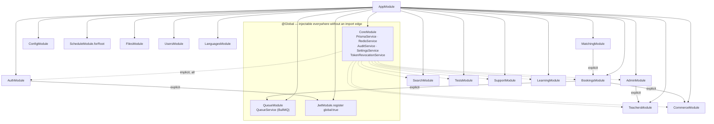
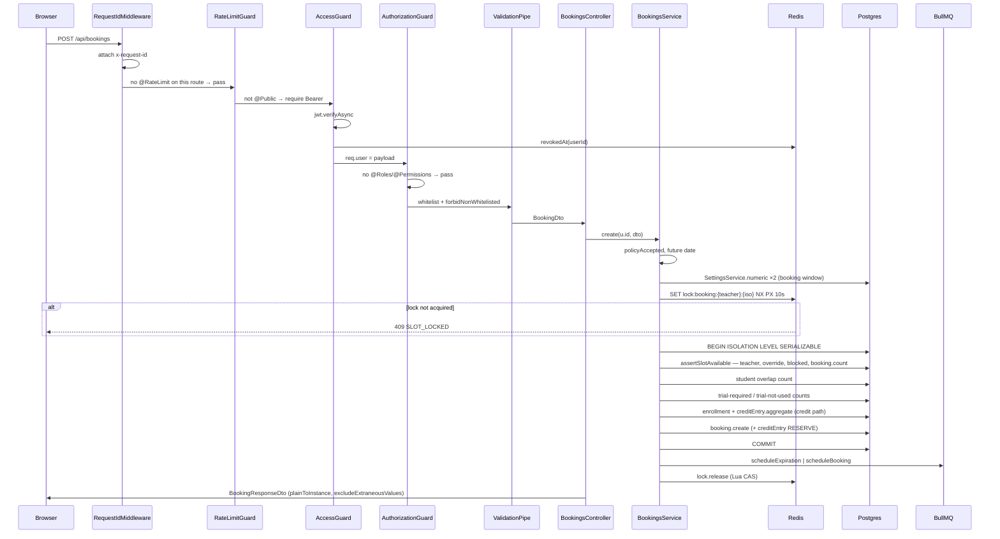

# Phase 1 — System map

## 1.1 Module dependency graph

Derived from the `imports:` array of every `*.module.ts`. Two modules are `@Global`, so most
edges are implicit — that is the dominant structural fact about this codebase.

Only **four** explicit inter-module edges exist in the whole backend:

| Edge | Declaration |
| --- | --- |
| `BookingsModule → QueueModule, CommerceModule` | `bookings.module.ts:3` |
| `MatchingModule → BookingsModule` | `matching.module.ts` |
| `AdminModule → TeachersModule` | `admin.module.ts:2` |
| `AuthModule → JwtModule` | `auth.module.ts` |

**No circular module imports.** `Commerce` does not import `Bookings`, so the
`Bookings → Commerce` edge is acyclic; `Matching → Bookings → Commerce` is a chain, not a cycle.
`QueueService` reaches into commerce via a plain function import
(`queue.service.ts:5` → `releaseDiscount`), not a provider, which is what keeps
`Queue ↔ Commerce` from becoming a cycle.

Everything else is reachable because `CoreModule` (`common/core/common.module.ts:17-19`) and
`QueueModule` (`queue.module.ts`) are `@Global`. **`PrismaService` is globally injectable**, so
any service in any domain can query any table with no import edge to declare it. See §1.6.

## 1.2 Request lifecycle — `POST /api/bookings`

The representative write path: student books a lesson. Traced end to end.

Layer-by-layer, with citations:

| Step | Component | Evidence |
| --- | --- | --- |
| Middleware | `RequestIdMiddleware` on `'*'` | `app.module.ts:2` |
| Guard 1 | `RateLimitGuard` — no-op without `@RateLimit` | `rate-limit.guard.ts:36` (`if (!options) return true`) |
| Guard 2 | `AccessGuard` — global, deny-by-default | `app.module.ts:2`; `access-token.guard.ts:28-44` |
| Guard 3 | `AuthorizationGuard` — `@Roles`/`@Permissions` | `authorization.guard.ts:11-18` |
| Pipe | Global `ValidationPipe` `whitelist`+`forbidNonWhitelisted` | `main.ts:22` |
| Controller | `BookingsController.create` | `bookings.controller.ts:14-17` |
| Service | `BookingsService.create` | `bookings.service.ts:48-118` |
| Lock | Redis `SET NX PX 10000` | `redis.service.ts:23-36`; called `bookings.service.ts:63` |
| Transaction | `Serializable` | `bookings.service.ts:113` |
| Slot check | `assertSlotAvailable` | `availability.service.ts:238-264` |
| Response DTO | `plainToInstance(..., {excludeExtraneousValues:true})` | `bookings.controller.ts:16` |

**No repository layer is used on this path** — `BookingsService` calls `tx.booking.create` directly
(`bookings.service.ts:94`). `BookingsRepository` exists but serves only the list endpoints
(`bookings.service.ts:190-196`). The layering described in `CLAUDE.md`
("controllers → services → repositories") is aspirational for writes.

**Nothing is emitted.** There is no event bus, no domain events, no outbox. The only asynchronous
hand-off is the direct BullMQ enqueue at `bookings.service.ts:114-115`, which happens **after**
the transaction commits — see F-101.

### F-101 — enqueue-after-commit orphans `PENDING_PAYMENT` bookings, which hold the slot

`bookings.service.ts:114-115` enqueues the expiry job after `COMMIT`. There is no outbox and no
sweeper. If the process dies, is redeployed, or Redis rejects the write in that window, the job is
never created — and nothing else ever expires the booking:

- `expireBooking` runs **only** from the `booking-expiration` job (`queue.service.ts:47`).
- The 10-minute reconciliation cron covers *payments*, not bookings
  (`reconciliation.service.ts:63`).
- `assertSlotAvailable` counts `PENDING_PAYMENT` as occupying the slot
  (`availability.service.ts:261`), as does the public slot listing
  (`availability.service.ts:201`).

Result: the teacher's slot is blocked permanently and no user action clears it — `cancel()`
requires the student to act (`bookings.service.ts:198`), and the student has no reason to.
BullMQ's own `attempts:3` (`queue.service.ts:79`) does not help, because the job never existed.
Severity **medium**.

## 1.3 Background work

There is exactly **one queue** and **one cron**.

### Queue `notifications` (BullMQ) — `modules/queue/queue.service.ts`

Producer and consumer both live in the API process: `new Queue` at `:41`, `new Worker` at `:46`
inside `onModuleInit`. **Every API instance runs a worker** with `concurrency:5`, so job execution
competes with request handling on the same event loop. There is no separate worker process.

| Job | Trigger | Payload | Delay | Retries | Idempotency |
| --- | --- | --- | --- | --- | --- |
| `booking-expiration` | `scheduleExpiration` (`:79`), from `bookings.service.ts:114` | `{bookingId}` | until `paymentExpiresAt` | `attempts:3`, exponential 5 s | `jobId:expiration-{bookingId}`; handler re-checks status + `paymentExpiresAt` (`:80`) |
| `booking-reminder` | `scheduleBooking` (`:85`), from booking create/settle/reschedule | `{reminderId}` | 24 h and 1 h before start | `attempts:5`, exponential 30 s | `jobId:reminder-{id}`; `Reminder` unique `(bookingId,type)` (`schema.prisma:1094`); per-recipient `Notification.idempotencyKey` (`:56-58`) and SMS-already-sent short-circuit (`:59`) |

Idempotency on this queue is **good**. Handlers re-read state and bail:
`queue.service.ts:50` skips reminders whose booking is no longer `CONFIRMED` — so a cancelled
booking's already-queued reminder self-heals rather than needing to be removed.
`queue.service.ts:80` makes expiry a no-op unless the booking is still `PENDING_PAYMENT` and past
its deadline.

Failure handling: per-recipient errors are recorded on `NotificationDelivery` with
`status:'failed'` and an incremented `attempts` (`:70`), then rethrown (`:75`) so BullMQ retries.
`removeOnFail:{count:500}` keeps a bounded dead-letter tail. This is correct.

**Gap:** `booking-expiration` has no dead-letter consumer. After 3 failed attempts the booking
stays `PENDING_PAYMENT` forever, with the same slot-blocking consequence as F-101. Nothing alerts.

### Cron — `ReconciliationService`, `@Cron(EVERY_10_MINUTES)` (`reconciliation.service.ts:63`)

Single-flight across instances via a Redis lock (`:57` comment). Re-verifies stale settleable
payments against Zarinpal, writes a `Reconciliation` row per discrepancy, and settles through
`PaymentsService.settleVerified()` — the same path a real callback uses
(`payments.service.ts:213`). This is the correct design: one fulfilment path, not two.

## 1.4 External integrations

| Provider | Caller | Timeout | Retry | On failure |
| --- | --- | --- | --- | --- |
| Zarinpal `payment/request` | `gateway.service.ts:25` | **none** | **none** | `BadGatewayException` (`:28`) → 502 |
| Zarinpal `payment/verify` | `gateway.service.ts:45` | **none** | **none** | `{ok:false}` → `failPayment` (`payments.service.ts:197`); cron re-verifies later |
| Kavenegar OTP | `sms.service.ts:7` | **none** | **none** | see Phase 7 |
| Kavenegar reminder | `queue.service.ts:65` | **none** | BullMQ `attempts:5` | delivery marked `failed`, rethrown, retried (`:69-75`) |
| Kavenegar ticket | `support.service.ts:194` | **none** | **none** | — |
| MinIO / S3 | `files.service.ts` | SDK default | SDK default | — |

### F-102 — no timeout on any outbound provider call

All five `fetch()` call sites use bare `fetch` with no `AbortSignal.timeout` and no
`signal` option. Node's `fetch` has **no default request timeout**; a provider that accepts the
connection and never responds holds the Node socket, the Express request, and — for
`gateway.verify` — an open path inside the payment callback until the OS TCP timeout (minutes).

Worst case is the payment callback (`payments.service.ts:196`): Zarinpal hanging stalls callbacks
while the 10-minute reconciliation cron piles up more verify attempts behind the same stall. The
BullMQ worker is bounded at `concurrency:5` (`queue.service.ts:76`), so five hung Kavenegar calls
stall **all** reminder delivery.

Fix is one line per call site (`AbortSignal.timeout(ms)`), but F-006 applies: the Kavenegar URL is
built by hand in three places, so it must be fixed three times. Severity **medium**.

## 1.5 Frontend ↔ backend contract

**Authentication.** Access token in `sessionStorage`, refresh token in an HTTP-only cookie sent
via `credentials:'include'` (`apps/web/src/lib/api.ts:31-33`). `api()` retries once on 401 after
refreshing (`:34-37`). The shared in-flight refresh promise (`:15-27`) is a genuinely good
detail — it prevents N parallel 401s from sending the same refresh token N times, which the
server's family-revocation-on-reuse (`auth.service.ts:29`) would read as token theft and use to
sign the user out entirely.

**Where API types live — and the drift.** `packages/contracts` is meant to be the shared source of
truth, but at 43 lines it carries only `phoneSchema`, `requestOtpSchema`, `verifyOtpSchema`,
`matchingSchema`, `bookingSchema`, `PACKAGE_TIERS`, and a `TeacherCard` type
(`packages/contracts/src/index.ts:1-43`). It has **4 importers in the entire monorepo**:

| Importer | What it uses |
| --- | --- |
| `apps/api/.../packages.dto.ts:2` | `PACKAGE_TIERS` |
| `apps/api/.../packages.service.ts:3` | `PACKAGE_TIERS`, `PackageTier` |
| `apps/web/src/app/matching/page.tsx:6` | `matchingSchema`, `MatchingInput` |
| `apps/web/src/components/panel-actions.tsx:7` | `PACKAGE_TIERS` |

Every **response** type is hand-copied into `apps/web/src/lib/api.ts:44-49`.
`PublicTeacher` (`:46`) restates ~25 fields of the Prisma `Teacher` model with no derivation from
`TeacherResponse` on the API side and no compile-time link of any kind. Nothing detects drift: a
renamed or removed API field is a runtime `undefined` in the browser, not a build error.

Three symptoms of that already visible in the same file:

1. **Two rival pagination envelopes** — `Paginated<T> = {data,total,page,totalPages}` and
   `ItemsPage<T> = {items,pagination:{page,pageSize,total,pages,hasMore?}}`
   (`apps/web/src/lib/api.ts:48-49`). Both are live; a caller must know which endpoint returns which.
2. **`TeacherCard` in contracts is unused by both apps** — the web uses its own `PublicTeacher`
   instead (`packages/contracts/src/index.ts:43` vs `apps/web/src/lib/api.ts:46`). The shared type
   that exists is the one nobody imports.
3. **`Role` in contracts is `'student'|'teacher'|'admin'`** (`packages/contracts/src/index.ts:42`),
   lowercase and three-valued. The database enum is `STUDENT|TEACHER|ADMIN|STAFF|EXAMINER|SUPPORT|FINANCE`
   (`schema.prisma:10-18`), uppercase and seven-valued. The shared type is simply wrong, and would
   mistype any code that trusted it.

This is F-004, confirmed and upgraded with concrete evidence.

## 1.6 Boundary violations

`PrismaService` is `@Global` (`common/core/common.module.ts:17-19`), so domain ownership is a
naming convention with nothing enforcing it. Measured by extracting every `this.db.<model>` /
`this.prisma.<model>` reference per file:

| Service | Models touched | Cross-domain reach |
| --- | --- | --- |
| `admin/admin.service.ts` | **14** — auditLog, booking, cmsPage, payment, payoutBatch, permission, rolePermission, setting, teacher, testAttempt, ticket, user, userRole, walletEntry | 9 domains |
| `admin/admin.repository.ts` | 8 | 6 domains |
| `tests/tests.service.ts` | 8 | 2 (own + files, languages) |
| `search/search.service.ts` | **7** — booking, language, passage, payment, teacher, testDefinition, user | **owns no tables at all** |
| `support/support.service.ts` | 7 — incl. cmsPage, setting | reaches into `admin` |
| `commerce/payouts/payouts.service.ts` | 6 — incl. booking, walletEntry | reaches into `bookings`, `payments` |
| `learning/learning.service.ts` | 5 — incl. booking, teacher | reaches into `bookings`, `teachers` |
| `teachers/teachers.service.ts` | 4 — incl. booking | reaches into `bookings` |
| `bookings/bookings.service.ts` | 2 — booking, notification | reaches into `support` |
| `auth/sms.service.ts` | 2 — notification, user | reaches into `support` |
| `users/users.service.ts` | 3 — favorite, teacher, user | reaches into `teachers` |

Findings from that matrix:

### F-103 — `SearchService` reads `payment` and `booking` directly while owning no tables

`search.service.ts` touches `booking`, `payment`, `user`, `teacher`, `language`, `testDefinition`,
`passage`. A search/read-model component holding direct read access to the payments table is the
clearest ownership breach in the codebase: any change to `Payment` must now be regression-tested
against a module nobody would think to check. Severity **medium** (maintainability; the queries
themselves are assessed in Phase 4).

### F-104 — notification writes are scattered across five domains

`Notification` is owned by `support` (per module layout) but is created directly by
`bookings.service.ts:267`, `:319`, `:351`, `:397`; `payments.service.ts:303`;
`auth/sms.service.ts`; and `queue.service.ts:58`. There is no `NotificationsService` that owns the
model. Consequences visible in the code: `queue.service.ts:58` sets `idempotencyKey` and creates a
`NotificationDelivery`, while `bookings.service.ts:267` sets neither — so booking notifications
have no dedupe key and no delivery row, and `NotificationPreference` (`schema.prisma:1074-1083`)
is **not consulted** on those paths. A user who disabled a notification type still gets it.
Severity **medium**.

### F-105 — `AdminService` is a 14-model god object

`admin/admin.service.ts` writes to `userRole`, `rolePermission`, `setting`, `cmsPage` and reads
`payment`, `walletEntry`, `payoutBatch`, `booking`, `testAttempt`, `ticket`, `teacher`.
Admin is inherently cross-cutting, so some breadth is legitimate; the problem is that it reaches
the **tables** rather than the owning domains' services, so domain invariants enforced in those
services (for example the price-approval workflow in `pricing.service.ts`) can be bypassed by an
admin write. Assessed concretely in Phase 4/7. Severity **medium**.

## 1.7 What this map says about the system

The transactional core is more carefully built than the brief anticipates. Booking creation runs
under a Redis lock *and* `Serializable` isolation *and* an in-transaction re-check
(`bookings.service.ts:63,113`; `availability.service.ts:261`); payment settlement is idempotent,
re-checks status inside the transaction, and retries `P2034` (`payments.service.ts:213-234`);
`P2034` is mapped to a user-readable 409 rather than a 500 (`domain.exception.ts:60-65`); the
exception filter logs stack traces server-side and never returns them (`api-exception.filter.ts:47-52`).

The weaknesses are at the **edges**, not the core: work handed off after commit with no outbox
(F-101), provider calls with no timeout (F-102), a shared-contract package that almost nothing
imports (F-004), and a global Prisma client that lets every module read every table (F-103–F-105).

Two facts carried into later phases, both established here:

- **Money is stored in toman; the ×10 conversion to rial is isolated to `gateway.service.ts:8`**
  and applied consistently in both `request()` (`:25`) and `verify()` (`:45`). The brief's "implicit
  ×10" hazard is handled correctly. Re-verified in Phase 6.
- **No refund path ever contacts the payment gateway.** `bookings.service.ts:217-227`,
  `payments.service.ts:291-300`, and `refunds.service.ts:23-24` all write `Refund.status:'completed'`
  and credit `WalletEntry`. `Refund.gatewayReference` (`schema.prisma:730`) is never written.
  Combined with `WithdrawalRequest` being teacher-only (`schema.prisma:788`), a student's money can
  only ever return as store credit. Carried to Phase 6 as the leading integrity finding.

## Phase 1 findings

| ID | Sev | Title | Evidence |
| --- | --- | --- | --- |
| F-101 | medium | Expiry job enqueued after commit with no outbox or sweeper; orphaned `PENDING_PAYMENT` bookings block the teacher's slot permanently | `bookings.service.ts:114-115`; `availability.service.ts:201,261`; `queue.service.ts:47` |
| F-102 | medium | No timeout on any of the 5 outbound provider calls; a hung provider stalls payment callbacks and all reminder delivery | `gateway.service.ts:25,45`; `sms.service.ts:7`; `queue.service.ts:65`; `support.service.ts:194` |
| F-103 | medium | `SearchService` owns no tables yet reads `payment` and `booking` directly | `search.service.ts` |
| F-104 | medium | `Notification` written from 5 domains with no owning service; booking notifications skip `idempotencyKey`, `NotificationDelivery`, and `NotificationPreference` | `bookings.service.ts:267,319,351,397` vs `queue.service.ts:58` |
| F-105 | medium | `AdminService` touches 14 models across 9 domains, reaching tables instead of owning services and bypassing domain invariants | `admin/admin.service.ts` |
