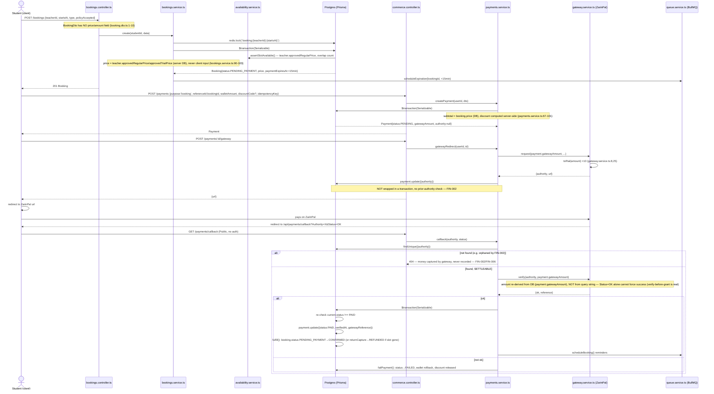

# Phase 2 — Financial Flows

Scope: `apps/api/src/modules/commerce/*`, `apps/api/src/modules/bookings/*` (money-adjacent parts only), `apps/api/src/modules/queue/queue.service.ts`, `apps/api/prisma/schema.prisma`, `apps/web/src/app/payment/*`. Read-only; no fixes applied. Money bugs are `critical` by default per audit convention; anywhere a fix would touch amount/rounding/currency/state-machine logic it is flagged `NEEDS-DECISION` rather than fixed.

There is no saga/distributed-transaction layer anywhere in this codebase — confirmed by exhaustive read of `apps/api/src/modules/commerce` and `apps/api/src/modules/queue`. Consistency is entirely: Postgres `prisma.$transaction` (mostly at `Serializable` isolation), unique constraints (`Payment.bookingId`, `Payment.authority`, `Payment.idempotencyKey`, `*.idempotencyKey` on ledger tables), and a `Reconciliation` Prisma model that — see FIN-006 — is never written to by any code path.

## PaymentStatus

`apps/api/prisma/schema.prisma:52-59`:
```
enum PaymentStatus { PENDING PAID FAILED EXPIRED REFUNDED PARTIALLY_REFUNDED }
```

### Every write site

| # | Location | From → To | Guard |
|---|---|---|---|
| 1 | `payments.service.ts:112` (`createPaymentRecord`) | (create) → `PENDING` | `gatewayAmount > 0` |
| 2 | `payments.service.ts:112` + `:128` (`fulfill`) | (create) → `PAID` | `gatewayAmount === 0` (100% wallet-paid) |
| 3 | `payments.service.ts:184` (`callback`, inside `$transaction`) | `PENDING`/`EXPIRED`/`FAILED` → `PAID` | `current.status !== 'PAID'` re-check (line 183) + outer `SETTLEABLE` filter (line 171/177) + real `gateway.verify()` (line 179) returned `ok:true` |
| 4 | `payments.service.ts:204` (`failPayment`) | `PENDING` → `FAILED` | `payment.status !== 'PENDING'` → no-op (line 201) |
| 5 | `payments.service.ts:257` (`returnCapture`, called from `fulfill`) | (whatever `fulfill` just set, incl. freshly-set `PAID`) → `REFUNDED` | booking no longer `PENDING_PAYMENT` at settlement time (line 219) |
| 6 | `queue.service.ts:84` (`expireBooking` job) | `PENDING` → `EXPIRED` | `booking.payment?.status === 'PENDING'` (line 80) |
| 7 | `refunds.service.ts:19` (admin refund) | **any status** → `REFUNDED` or `PARTIALLY_REFUNDED` | **none on prior status** — see FIN-001 |
| 8 | `bookings.service.ts:227` (cancellation refund) | `PAID` → `REFUNDED`/`PARTIALLY_REFUNDED` | `booking.payment?.status === 'PAID'` (line 214) |

### Legal vs. found transitions

| Legal (intended) | Found in code | Verdict |
|---|---|---|
| `PENDING → PAID` | Yes, only via `gateway.verify()` success (site 3) or 100%-wallet create (site 2) | correct |
| `PENDING → FAILED` | Yes (site 4), one-way guarded | correct |
| `PENDING → EXPIRED` | Yes (site 6), one-way guarded | correct |
| `EXPIRED/FAILED → PAID` | Yes (site 3, `SETTLEABLE` includes both) — intentional "late capture" handling, immediately followed by site 5's `returnCapture` if the booking slot is gone | correct, see FIN-005 note |
| `PAID → REFUNDED / PARTIALLY_REFUNDED` | Yes (sites 5, 7, 8) | correct |
| `PAID → PENDING` (backwards) | **Not found anywhere** — no write site sets `PENDING` except creation | not found |
| `REFUNDED/PARTIALLY_REFUNDED → PAID` (backwards) | **Not found** — `callback`'s `SETTLEABLE` list excludes both (payments.service.ts:171,176) | not found |
| **`PENDING/FAILED/EXPIRED → REFUNDED`** (skip PAID entirely) | **Yes — site 7, `refunds.service.ts:19`** | **found — FIN-001, critical** |

## Sequence diagram 1 — Booking a single lesson



## Sequence diagram 2 — Buying a Package

```mermaid
sequenceDiagram
    actor S as Student (client)
    participant PkC as packages.controller.ts
    participant PkS as packages.service.ts
    participant PC as commerce.controller.ts
    participant PS as payments.service.ts
    participant GW as gateway.service.ts
    participant DB as Postgres (Prisma)

    Note over PkS: Package.price computed once at teacher creation time:<br/>listPrice = teacher.approvedRegularPrice × credits;<br/>price = listPrice − round(listPrice × discountPercent/100)<br/>(packages.service.ts:62-63), gated by approvalStatus:APPROVED

    S->>PkC: GET /packages/teacher/:teacherId (Public)
    PkC-->>S: [{id, price, credits, ...}] (server-computed, DB-stored)

    S->>PC: POST /payments {purpose:'package', referenceId:packageId, walletAmount, discountCode?, idempotencyKey}
    PC->>PS: createPayment
    PS->>DB: $transaction(Serializable)
    DB->>DB: pkg = package.findUnique({id, approvalStatus:'APPROVED'})
    Note over PS: subtotal = pkg.price (DB), never client (payments.service.ts:70-72)
    DB-->>PS: Payment{status:PENDING, gatewayAmount}
    PC-->>S: Payment

    S->>PC: POST /payments/:id/gateway → GW.request → redirect (same as flow 1, same FIN-002 exposure)
    S->>GW: pays
    GW-->>S: redirect /api/payments/callback?Authority&Status=OK
    S->>PC: GET /payments/callback
    PC->>PS: callback(authority, status)
    PS->>GW: verify(authority, payment.gatewayAmount)
    GW-->>PS: {ok:true, reference}
    PS->>DB: $transaction(Serializable)
    DB->>DB: payment.update({status:PAID})
    DB->>DB: fulfill(): purpose==='package' branch
    DB->>DB: enrollment = Enrollment.create({studentId, packageId, creditsPurchased:pkg.credits, paymentId})
    DB->>DB: CreditEntry.create({type:PURCHASE, amount:pkg.credits, idempotencyKey:`purchase:{paymentId}`})
    Note over DB: entitlement write is in the SAME $transaction as status:PAID (payments.service.ts:181-189) — atomic
    PC-->>S: 200
    Note over S: /payment/success page (apps/web/src/app/payment/success/page.tsx) is static — it does NOT itself grant anything; entitlement already exists in DB by the time this renders
```

## Findings

### FIN-001 — `refunds.service.ts` admin refund has no precondition on `Payment.status` (critical, CONFIRMED)

`apps/api/src/modules/commerce/refunds.service.ts:9-22`. The handler reads `payment.amount` and an aggregate of prior `completed` refunds, validates `0 < amount <= payment.amount - already`, then unconditionally creates a `Refund`, credits the user's wallet (`WalletEntry` CREDIT), and sets `Payment.status` to `REFUNDED`/`PARTIALLY_REFUNDED` (line 19) — **there is no check that `payment.status === 'PAID'` (or `PARTIALLY_REFUNDED`) first**. Contrast with the two other refund call sites, which both do gate on `PAID`: `payments.service.ts` only reaches `returnCapture` from a `SETTLEABLE`-then-`PAID` path, and `bookings.service.ts:214` explicitly checks `booking.payment?.status === 'PAID'`.

Reproduction: an ADMIN/FINANCE actor (route is `@Roles('ADMIN','FINANCE') @Permissions('payments.refund')`, `commerce.controller.ts:40-45`) calls `POST /payments/:id/refunds` on a `Payment` that is still `PENDING` (gateway never captured anything) or `FAILED`/`EXPIRED`. The check `amount > payment.amount - already` passes (nothing refunded yet), a `WalletEntry` CREDIT for real money is created, and `Payment.status` flips to `REFUNDED` — crediting a wallet for money the platform never received. This is an internal-actor-only bug (not exploitable by a student), but it is a genuine invariant gap in the state machine, and the audit's own rule makes any money-crediting bug critical by default.

`NEEDS-DECISION`: add a `payment.status` precondition (e.g. restrict to `PAID`/`PARTIALLY_REFUNDED`) — left as a recommendation, not applied, since it touches money-state-machine logic.

### FIN-002 — `gatewayRedirect` has no idempotency/lock; repeated calls orphan ZarinPal authorities (critical, CONFIRMED)

`apps/api/src/modules/commerce/payments.service.ts:156-161`:
```ts
async gatewayRedirect(userId: string, paymentId: string) {
  const payment = await this.db.payment.findFirstOrThrow({ where: { id: paymentId, userId, status: 'PENDING' } });
  const result = await this.gateway.request(payment.gatewayAmount, `LingoSpeak ${payment.purpose}`, `${config().API_URL}/api/payments/callback`);
  await this.db.payment.update({ where: { id: payment.id }, data: { authority: result.authority } });
  return result;
}
```
No transaction, no lock, and no check that `payment.authority` is already set. Calling this endpoint (`POST /payments/:id/gateway`) twice for the same `Payment` row — double-click on "Pay", or the student navigating back and retrying — creates **two independent ZarinPal payment sessions**, each with its own `authority`. The second `payment.update` overwrites the first `authority` in the DB (plain field update, not append; `Payment.authority` is `@unique` but that only prevents two rows sharing one authority — it does not stop one row's authority column being reassigned). If the student completes checkout on the *first* ZarinPal session (e.g., two tabs, or the first request's response is the one the browser navigates to), ZarinPal captures the money and redirects to `/payments/callback?Authority=<first>&Status=OK`, but `payments.service.ts:174`'s `findUnique({where:{authority}})` finds nothing (the DB row now points at the *second* authority) → `NotFoundException`. The gateway has captured real money for an authority the platform can no longer look up. Nothing else in the codebase queries ZarinPal for orphaned authorities (see FIN-006), so this is silent.

Reproduction steps: create a payment, call `POST /payments/:id/gateway` twice in quick succession (or sequentially, no concurrency needed), note two distinct `authority` values returned; only the second is ever queryable via `/payments/callback`.

`NEEDS-DECISION`: the safe direction is either (a) short-circuit if `payment.authority` is already set and re-derive/reuse the existing ZarinPal session, or (b) wrap in a lock keyed by `paymentId` similar to the booking-slot Redis lock. Not implemented here per the hard rule against writing state-machine/money-flow fixes.

### FIN-003 — Teacher withdrawal request race: no Serializable isolation, no idempotency key (critical, CONFIRMED)

`apps/api/src/modules/commerce/payouts.service.ts:107-120` (`requestWithdrawal`):
```ts
return this.db.$transaction(async tx => {
  const ledger = await tx.walletEntry.groupBy(...);         // read balance
  const pending = await tx.withdrawalRequest.aggregate(...); // read pending withdrawals
  const available = balance - (pending._sum.amount ?? 0);
  if (amount > available) throw badRequest(...);
  return tx.withdrawalRequest.create({ data: { teacherId, amount, iban } });
});
```
No `{ isolationLevel: Prisma.TransactionIsolationLevel.Serializable }` is passed — contrast with every money-critical transaction in `payments.service.ts` (lines 130, 189) and `bookings.service.ts` (lines 113, 317, 409), which all explicitly opt into `Serializable`. `prisma.service.ts:6` sets no client-level default either, so this transaction runs at Postgres's default `READ COMMITTED`. Two concurrent `POST /teacher/finance/withdrawals` calls (double-click, or two browser tabs) can both read the same `available` balance before either's `create` commits, and both pass the `amount > available` check — over-withdrawing the teacher's real balance. `WithdrawalRequestDto` (`apps/api/src/modules/commerce/dto/request/withdrawal-request.dto.ts:1-9`) also carries no `idempotencyKey`, so there is no dedupe safety net at the DTO layer either (compare `PayDto.idempotencyKey`, `RefundDto.idempotencyKey`).

Reproduction: teacher with 100,000 available balance fires two `POST /teacher/finance/withdrawals {amount:90000,...}` requests concurrently; under READ COMMITTED both transactions can read `available=100000` before either commits its `create`, so both succeed, creating 180,000 in `PENDING` withdrawal requests against 100,000 actually available.

`NEEDS-DECISION`: safe direction is `Serializable` isolation (matching the rest of the money-critical code) and/or a per-teacher advisory lock; not applied here.

### FIN-004 — No idempotency guard on withdrawal double-submit at the DTO/request layer (medium, subset of FIN-003)

Same root cause as FIN-003; called out separately because it compounds it — even a fixed isolation level wouldn't stop a client-side double-submit from creating two distinct, both-legitimate-looking `WithdrawalRequest` rows (Serializable would just make one of the two fail with `P2034` — the client still needs to not blindly retry both). No `idempotencyKey` field exists on `WithdrawalRequestDto` to converge retries the way `PayDto`/`RefundDto` do.

### FIN-005 — `Reconciliation` model exists in schema but is never written by any code path (critical, CONFIRMED)

`grep -rn "Reconciliation" apps/api/src --include=*.ts` (excluding `.spec.ts` and the schema file itself) has exactly one hit: `apps/api/src/modules/admin/admin.repository.ts:86`, which only *reads* the (always-empty) relation as part of `getPayments()`'s `include`. No service, job, or controller anywhere calls `tx.reconciliation.create(...)` or equivalent. There is no `@nestjs/schedule`/`Cron` usage in the API at all (`grep -rln "Cron\|@nestjs/schedule" apps/api/src` → only the same `admin.repository.ts` hit, which is unrelated to scheduling).

This matters because of the ordering in `payments.service.ts:callback()` (lines 173-196): `gateway.verify(authority, ...)` — a real network call that, on success, means ZarinPal has *irreversibly* confirmed the capture — happens **before** the `$transaction` that marks `Payment.status = PAID` and grants the entitlement (booking confirmation / enrollment + credits). If the process crashes, the DB connection drops, or the request is otherwise interrupted between `gateway.verify()` returning `ok:true` (line 179) and the transaction committing (line 189), the money is captured by ZarinPal but the DB still shows the payment as `PENDING`/`FAILED`/`EXPIRED` and no entitlement was granted. This *can* self-heal if the callback is replayed (browser back-button, or ZarinPal itself retries the redirect) — `gateway.verify()` on a second call typically returns ZarinPal code `101` ("already verified"), which `gateway.service.ts:38` treats as `ok`, so a replay would complete the transaction correctly. But if no replay ever occurs (user closes the tab immediately after payment, before the redirect completes), the gap is **permanently silent**: no cron job, no manual admin action, and no `Reconciliation` row is ever created to flag or repair it. The `Reconciliation` model's `providerAmount`/`providerStatus`/`matched` fields (`schema.prisma:736-745`) describe exactly the mechanism that would catch this, but nothing populates it.

This is the same root gap FIN-002 exposes from a different angle: neither the "extra authority" case (FIN-002) nor the "crash mid-verify" case (FIN-005) has any repair mechanism.

### FIN-006 — Booking double-booking / slot race: NOT-FOUND, verified as correctly guarded

`apps/api/src/modules/bookings/bookings.service.ts:63-113`. Guarded by two independent layers: a Redis `SET NX PX` lock keyed `booking:{teacherId}:{startsAt}` (`bookings.service.ts:63-64`, `apps/api/src/common/redis.service.ts:11`), and inside that, a `Prisma.TransactionIsolationLevel.Serializable` transaction (`bookings.service.ts:113`) that re-derives availability (`availability.service.ts:241-266`, count-based overlap check on `Booking` rows with status `PENDING_PAYMENT`/`CONFIRMED`) and re-checks student overlap (`bookings.service.ts:68-71`). There is **no** DB-level `@@unique` constraint on `(teacherId, startsAt)` in `schema.prisma:459-500` (only `@@index`s at lines 498-499) — the safety is Serializable-isolation write-skew detection (Postgres SSI aborts one of two concurrent conflicting transactions with `P2034`, mapped to a 409 by `apps/api/src/common/errors.ts:60-65`) plus the Redis lock as a first line of defense. As written today this correctly prevents double-booking; flagging as a structural caveat rather than a bug: if a future change ever drops the explicit `Serializable` isolation option (e.g. someone "simplifies" the transaction call), this protection silently degrades to just the best-effort Redis lock (10s TTL, not re-entrant across retries) with no DB-level backstop. Not itself a fix recommendation — just noting the invariant is enforced by isolation-level discipline, not by schema.

### FIN-007 — Amount authority: CONFIRMED correct everywhere checked

- `PayDto` (`apps/api/src/modules/commerce/dto/request/pay.dto.ts:1-9`) carries `purpose`, `referenceId`, `walletAmount`, `discountCode`, `idempotencyKey` — **no `amount` field at all**. `createPaymentRecord` (`payments.service.ts:54-131`) computes `subtotal` from `booking.price` (server-set at booking-creation time from `teacher.approvedRegularPrice`/`approvedTrialPrice`, `bookings.service.ts:90`) or `pkg.price` (server-computed at package-creation time, `packages.service.ts:62-63`), applies discount server-side, and only the resulting `gatewayAmount` is what reaches `gateway.service.ts`'s `request()` (`payments.service.ts:158`, `gateway.service.ts:22`).
- `BookingDto` (`apps/api/src/modules/bookings/dto/request/booking.dto.ts:1-10`) carries no price field either.
- `PackageDto` (`apps/api/src/modules/commerce/dto/request/package.dto.ts:1-18`) carries `discountPercent` (teacher's own bundle discount, bounded `0-80`) but not `price`/`listPrice` — those are derived server-side from `teacher.approvedRegularPrice` (`packages.service.ts:55-63`), explicitly to prevent selling at an unapproved rate (comment at `packages.service.ts:36-40`).
- `RefundDto` (`refund.dto.ts:1-7`) does carry a free-form `amount`, but that endpoint is admin/finance-only (`@Roles('ADMIN','FINANCE') @Permissions('payments.refund')`) and bounded server-side by `payment.amount - already refunded` (`refunds.service.ts:16`) — not a client-amount-authority violation, though see FIN-001 for the separate status-precondition gap on the same code path.
- `packages/contracts` (`grep -rln "amount" packages/contracts/src` → no hits) defines no competing/duplicate money DTOs that could drift from the API's own.

### FIN-008 — Currency/rounding: CONFIRMED, `toRial` is the sole ×10 site; rounding is consistent and integer-only

- `gateway.service.ts:8`: `const toRial=(toman:number)=>toman*10;` used only at `gateway.service.ts:25` (request) and `:36` (verify) — the only two places any ×10/÷10 conversion occurs (`grep -rn "toRial\|\* *10\|/ *10\b" apps/api/src/modules/commerce` confirms no other site).
- No `.toFixed(` anywhere in `apps/api/src/modules/commerce` or `apps/api/src/modules/bookings` (`grep` returned zero hits) — all money fields are Prisma `Int` (rial-free "toman" integers) end to end.
- All percentage math uses `Math.round()` (discount code: `payments.service.ts:86`; auto-discount: `auto-discounts.service.ts:53`; package price: `packages.service.ts:63`; earnings commission: `earnings.service.ts:41`) except booking-cancellation refunds, which use `Math.floor()` (`bookings.service.ts:215`) — a deliberate, consistent direction (floor favors the platform/against over-refunding by a rial on odd splits), not a drift bug. `auto-discounts.service.ts:55` (`Math.max(0, Math.min(subtotal, capped))`) and `payments.service.ts:86` (`Math.min(subtotal, ...)`) both clamp discounts to never exceed the subtotal.

### FIN-009 — Idempotency backing: CONFIRMED real unique constraints, not just app-level `if (exists)`

- `Payment.authority String? @unique` (`schema.prisma:645`) and `Payment.idempotencyKey String @unique` (`schema.prisma:647`) are real Prisma/Postgres unique constraints, not just application checks. `createPayment` (`payments.service.ts:23-45`) explicitly handles the P2002 race (concurrent same-idempotencyKey submits) by re-reading the winner's row (lines 33-39).
- Every ledger table has its own `idempotencyKey String @unique`: `WalletEntry` (`schema.prisma:678`), `CreditEntry` (`schema.prisma:560`), `Refund` (`schema.prisma:731`). Combined with the deterministic key formats (`wallet:${payment.id}`, `refund-ledger:${refund.id}`, `purchase:${payment.id}`, `late-capture:${payment.id}`, etc.) this makes replays of `fulfill`/`returnCapture`/`accrue` safe via `upsert` with `update: {}` no-ops (e.g. `payments.service.ts:246-255`, `earnings.service.ts:43-54,60-74`, `bookings.service.ts:217-227`).
- Double-delivered ZarinPal callback: safe — see the `SETTLEABLE` guard (`payments.service.ts:171,176-177`) plus the in-transaction re-check (`payments.service.ts:183`).

### FIN-010 — Verify-before-grant: CONFIRMED, no client-side/redirect-page grant path exists

`apps/web/src/app/payment/success/page.tsx` is a static server component with no data fetching — it does not call any API and cannot grant anything. Entitlement (`booking.status → CONFIRMED`, or `Enrollment`+`CreditEntry` creation) is written exclusively inside `payments.service.ts`'s `fulfill()` (line 208-229), which is only reachable from the `$transaction` inside `callback()` (line 181-189) after `gateway.verify()` (a real ZarinPal API call using the server-stored `payment.gatewayAmount`, not any client-supplied amount) returned `ok:true`. The one dev-mode exception — `gateway.service.ts:34`, `authority.startsWith('dev_') && !merchantId` auto-verifies — is closed off in production by a startup guard: `env.validation.ts:51-56` fails startup if `NODE_ENV==='production'` and `ZARINPAL_MERCHANT_ID` is unset, and `:58-63` fails startup if `ZARINPAL_SANDBOX` is enabled in production. `apps/web/src/app/payment/development/page.tsx` (the dev-only simulator UI) itself still round-trips through the real `/payments/callback` endpoint (`publicApi('/payments/callback?Authority=...&Status=OK')`), it does not fake success locally.

## Risk matrix

| Flow | Risk category | Verdict | Evidence |
|---|---|---|---|
| Booking | Amount authority | NOT-FOUND (correct) | `bookings.service.ts:90-103`, `booking.dto.ts:1-10`, `payments.service.ts:58-67` |
| Package | Amount authority | NOT-FOUND (correct) | `packages.service.ts:44-78`, `package.dto.ts:1-18`, `payments.service.ts:69-72` |
| Both | Currency/rounding | NOT-FOUND (correct) | `gateway.service.ts:8,25,36` (FIN-008) |
| Both | Idempotency (payment create) | NOT-FOUND (correct) | `payments.service.ts:23-45`, `schema.prisma:647` |
| Both | Idempotency (gateway session init) | **CONFIRMED critical** | FIN-002, `payments.service.ts:156-161` |
| Both | Idempotency (callback replay) | NOT-FOUND (correct) | `payments.service.ts:171,176-189` (FIN-009) |
| Both | State machine (PAID reachable only via verify) | NOT-FOUND (correct) | `payments.service.ts:179-184` |
| Both | State machine (refund precondition) | **CONFIRMED critical** | FIN-001, `refunds.service.ts:9-22` |
| Both | Atomicity (status write + entitlement write) | NOT-FOUND (correct, same `$transaction`) | `payments.service.ts:181-189` |
| Both | Atomicity (gateway-verify vs. DB-commit crash window) | **CONFIRMED critical (no repair path)** | FIN-005, `payments.service.ts:179-189` + absence of any writer to `Reconciliation` |
| Booking | Race (concurrent slot booking) | NOT-FOUND (correct) | FIN-006, `bookings.service.ts:63-113`, `availability.service.ts:241-266` |
| Both | Race (double-click pay-init, same booking/package) | NOT-FOUND (correct) | `Payment.bookingId @unique` (`schema.prisma:633`) + `clearBookingPaymentSlot` (`payments.service.ts:143-154`); package purchases aren't similarly capped per-package but are capped per-idempotencyKey |
| Both | Race (double-click gateway redirect) | **CONFIRMED critical** | FIN-002 |
| Payouts | Race (double-submit withdrawal) | **CONFIRMED critical** | FIN-003, FIN-004, `payouts.service.ts:107-120` |
| Payouts | Idempotency (payout batch generation) | NOT-FOUND (correct) | `PayoutItem.earningId @unique` (`schema.prisma:780`), comment at `payouts.service.ts:51-52` |
| Payouts | Authorization (withdraw > available) | NOT-FOUND *for a single request* (correct check exists) but race makes it bypassable — see FIN-003 | `payouts.service.ts:107-119` |
| Both | Verify-before-grant / forged return URL | NOT-FOUND (correct) | FIN-010 |
| Booking | Refund/cancel append-only ledger | NOT-FOUND (correct) | `bookings.service.ts:213-229` uses `upsert` with deterministic idempotencyKey, never mutates `Payment.amount`/`subtotal` |
| Both | Auditability (financial row overwritten in place) | NOT-FOUND (correct) | grep of all `payment.update(...)` call sites (`payments.service.ts:153,159,184,204,257`; `refunds.service.ts:19`; `bookings.service.ts:227`; `queue.service.ts:84`) — none ever touch `amount`/`subtotal`/`discountAmount`/`walletAmount`/`gatewayAmount` after creation, only `status`/metadata |
| Payouts | Payout double-booking of same earning | NOT-FOUND (correct) | `PayoutItem.earningId @unique` (`schema.prisma:780`) |
| Payouts | Wallet double-debit on payout transfer | NOT-FOUND (correct) | `upsert` + `idempotencyKey: payout-debit:${item.id}` (`payouts.service.ts:74-88`) and `withdrawal-debit:${request.id}` (`payouts.service.ts:131-135`) |
