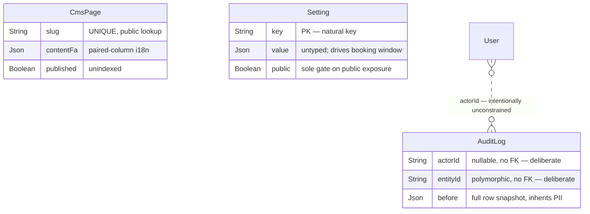

# Phase 2 — Schema: `admin`

Models: `CmsPage`, `Setting`, `AuditLog`. Service: `modules/admin/admin.service.ts` (+
`admin.repository.ts`), plus `common/core/services/settings.service.ts` and `audit.service.ts`.

Three small tables, but `Setting` and `AuditLog` are cross-cutting infrastructure rather than
admin-only data.

## 2.1 Structure

### `CmsPage` (`schema.prisma:1222-1232`)

| Field | Type | Required | Default | Index | Notes |
| --- | --- | --- | --- | --- | --- |
| `id` | String | ✅ | `cuid()` | PK | |
| `slug` | String | ✅ | — | **`@unique`** (:1224) | public lookup key |
| `titleFa`/`titleEn` | String | ✅ | — | none | paired-column i18n |
| `contentFa`/`contentEn` | Json | ✅ | — | none | rich content |
| `seo` | Json | ✅ | — | none | untyped |
| `published` | Boolean | ✅ | `false` | **none** | |
| `updatedAt` | DateTime | ✅ | `@updatedAt` | none | **no `createdAt`** |

`GET /support/pages/:slug` is `@Public()` (`routes.json`) and looks up by `slug` — served by the
unique index. But it must also filter `published = true`, which is unindexed; at this table's size
(a handful of rows) that is irrelevant.

`CmsPage` is the only model in the schema with an `updatedAt` and **no `createdAt`**.

### `Setting` (`schema.prisma:1234-1239`)

| Field | Type | Required | Default | Notes |
| --- | --- | --- | --- | --- |
| `key` | String | ✅ | — | **PK is the key itself** — no surrogate id |
| `value` | Json | ✅ | — | untyped |
| `public` | Boolean | ✅ | `false` | gates exposure via `GET /support/public-settings` |
| `updatedAt` | DateTime | ✅ | `@updatedAt` | |

Using the natural key as the PK is the right call for a key-value table.

`Setting` is **load-bearing for booking correctness**: `booking.minLeadMinutes` and
`booking.maxAdvanceDays` are read through `SettingsService.numeric(key, default, max)` on
**every booking attempt and every public slot listing** (`bookings.service.ts:127-130`;
`availability.service.ts:188-191`). Both call sites pass a default and a ceiling, so a missing or
absurd row degrades safely rather than opening the booking window — a good defensive pattern
around an untyped `Json` column.

`value Json` with no schema means a typo (`"120"` vs `120`, or `{"minutes":120}`) is accepted by
the database; `SettingsService.numeric` is the only thing standing between that and the booking
window. The `public` flag is the sole authorization control on
`GET /support/public-settings` — a single boolean deciding what leaves the system unauthenticated.

### `AuditLog` (`schema.prisma:1241-1255`)

| Field | Type | Required | Index | Notes |
| --- | --- | --- | --- | --- |
| `actorId` | String? | ❌ | `@@index([actorId, createdAt])` (:1254) | **nullable, loose string, no FK** |
| `action` | String | ✅ | none | free string |
| `entity` | String | ✅ | `@@index([entity, entityId])` (:1253) | free string |
| `entityId` | String? | ❌ | ↑ | polymorphic, no FK |
| `before`/`after` | Json? | ❌ | none | **full row snapshots** |
| `ip`/`userAgent` | String? | ❌ | none | PII |

Both indexes match real queries (`GET /admin/audit-logs` filters by entity or actor). Polymorphic
`entity`/`entityId` with no FK is **correct** here — an audit log must survive deletion of the thing
it describes, so the absence of a foreign key is deliberate, not an oversight. This is the one
place in the schema where FK-less polymorphism is the right answer.

`before`/`after` storing whole row snapshots means the audit log inherits whatever PII the audited
row held — user phone numbers, `WithdrawalRequest.iban`, ticket bodies. There is no redaction layer
and no retention policy. Carried to Phase 7.

`actorId` nullable supports system-initiated actions, but nothing distinguishes "system" from
"actor not recorded".

## 2.2 Relationship diagram

**None of the three models has a single foreign key.** For `AuditLog` that is correct by design;
for `CmsPage` and `Setting` there is simply nothing to reference.

## 2.3 Read/write profile

| Entity | Read by | Written by | Cardinality | Growth | Profile |
| --- | --- | --- | --- | --- | --- |
| `CmsPage` | `GET /support/pages/:slug` (**public**), `GET /admin/cms` | `PUT /admin/cms/:slug` | ~10 rows | static | **read-only in practice** |
| `Setting` | **every booking attempt and every public slot listing** (`SettingsService.numeric`), `GET /support/public-settings` (public), `GET /admin/settings` | `PUT /admin/settings/:key` | ~20 rows | static | **extremely read-heavy, tiny** |
| `AuditLog` | `GET /admin/audit-logs` | `AuditService` across admin mutations | grows with every admin action | linear, **never pruned** | **append-only, write-heavy** |

`Setting` is the hottest tiny table in the system: two rows are read on every `POST /bookings` and
every public `GET /availability/:teacherId/slots`, and both call sites issue them as a
`Promise.all` pair of separate queries (`bookings.service.ts:127-130`;
`availability.service.ts:188-191`). Whether `SettingsService` caches is the deciding question —
assessed in Phase 5.

`AuditLog` with `before`/`after` JSON snapshots is the fastest-growing table per admin action and
has no retention policy. Combined with the unbounded growth of `OtpChallenge`, `RefreshSession`,
`Notification`, `NotificationDelivery` and `Reminder` (F-201, F-253, §support), **six tables in
this schema grow monotonically with no reclamation path anywhere in the codebase.** That is a
systemic pattern rather than six separate oversights, and it is consolidated as a single
remediation item in Phase 8.

## Findings

| ID | Sev | Title | Evidence |
| --- | --- | --- | --- |
| F-2F1 | medium | `AuditLog.before`/`after` store full row snapshots with no redaction, inheriting PII (phone, `iban`, ticket bodies), and no retention policy | `schema.prisma:1247-1248`, `:1249-1250` |
| F-2F2 | low | `Setting.value` is untyped `Json` driving the booking window; correctness rests entirely on `SettingsService.numeric`'s default+ceiling clamping | `schema.prisma:1236`; `bookings.service.ts:127-130`; `availability.service.ts:188-191` |
| F-2F3 | low | `Setting.public` is a single boolean acting as the only authorization control on the unauthenticated `GET /support/public-settings` | `schema.prisma:1237`; `routes.json` |
| F-2F4 | low | `CmsPage` has `updatedAt` but no `createdAt` — the only model in the schema missing it | `schema.prisma:1222-1232` |
| F-2F5 | low | `AuditLog.actorId` nullable with no way to distinguish "system action" from "actor not recorded" | `schema.prisma:1243` |
