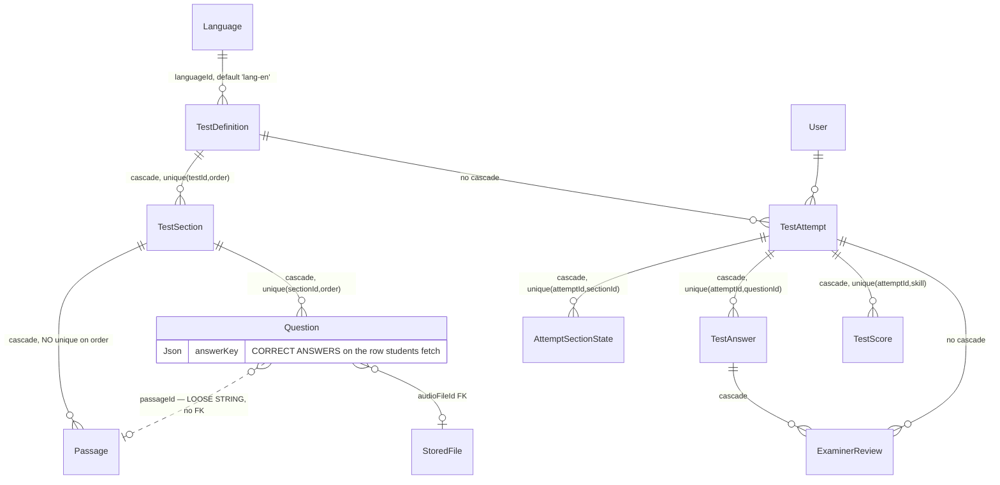

# Phase 2 — Schema: `assessment`

Models: `TestDefinition`, `TestSection`, `Passage`, `Question`, `TestAttempt`,
`AttemptSectionState`, `TestAnswer`, `TestScore`, `ExaminerReview`.
Services: `tests.service.ts`, `scoring.service.ts`.

Nine models — the largest domain by model count. It splits cleanly into a **definition tree**
(authored by examiners) and an **attempt tree** (produced by students).

## 2.1 Structure

### Definition tree

**`TestDefinition`** (`schema.prisma:810-829`): `slug @unique` (:811), `languageId` FK default
`"lang-en"` (:813 — **a hardcoded seed id as a column default**), `level String?`,
`titleFa/En`, `descriptionFa/En`, `version Int` default 1, `published Boolean` default false,
`durationMinutes`. Index: `@@index([languageId, published])` (:828).

`version` is an integer that is never branched on structurally — there is no
`@@unique([slug, version])`, so two versions of a test cannot coexist under one slug. Editing a
published test mutates it in place, which silently changes the meaning of attempts already scored
against it. **F-291.**

**`TestSection`** (`:831-845`): `testId` (cascade), `skill String` (**free string** — reading/
listening/writing/speaking), `title`, `instructions Json`, `durationMinutes`, `order Int`,
`lockAfterSubmit Boolean` default true. **`@@unique([testId, order])`** (:844) — correct, prevents
duplicate ordering.

**`Passage`** (`:847-856`): `sectionId` (cascade), `title`, `content Json`, `audioFileId` → FK to
`StoredFile` (:854), `order Int`. **No unique on `(sectionId, order)`** — unlike `TestSection` and
`Question`, which both have one. Inconsistent. **F-292.**

**`Question`** (`:858-875`): `sectionId` (cascade), `passageId String?` — **declared but with no
`@relation`** (:862), so it is a loose string with no FK while `audioFileId` two lines later is a
real FK (:869). `prompt Json`, `type String` (free), `choices Json?`, **`answerKey Json?`**,
`scoringRule Json?`, `points Float` default 1, `order Int`. **`@@unique([sectionId, order])`** (:874).

**`answerKey` living on `Question`** is the security-relevant shape decision in this domain: the
correct answers sit on the same row the student must fetch to render the question. Any endpoint
that returns a `Question` without an explicit `select` leaks the answer key. Verified in Phase 4/7 —
this is the highest-value check in the domain.

### Attempt tree

**`TestAttempt`** (`:877-898`): `userId` FK, `testId` FK, `status TestStatus`
(`IN_PROGRESS|SUBMITTED|AUTO_SCORED|UNDER_REVIEW|APPROVED|EXPIRED`), `currentSectionId String?`
(**loose string, no FK**), `startedAt`, `expiresAt`, `lastSavedAt`, `submittedAt?`,
`overallBand Float?`. Index: `@@index([userId, createdAt])` (:897).

**No `@@unique` preventing multiple concurrent `IN_PROGRESS` attempts** for the same
`(userId, testId)`. Whether the service enforces one is a Phase 4 question
(`tests.service.resume.spec.ts` suggests resume logic exists). `status` is unindexed.

**`AttemptSectionState`** (`:900-912`): `attemptId` (cascade), `sectionId` (**loose string, no
FK**), `status String` default `"available"` (**free string**), `startedAt?`, `submittedAt?`,
`remainingSeconds Int`, `flags String[]`. **`@@unique([attemptId, sectionId])`** (:911) — correct.

`remainingSeconds` stored as a mutable integer is a **client-reported timer**: it is the
server's record of how much time is left, but its value comes from save calls. Timer integrity is
a Phase 7 concern (`expiresAt` on the attempt is the real guard).

**`TestAnswer`** (`:914-943`): `attemptId` (cascade), `questionId` FK, `value Json?`,
`textValue String?`, `fileId?` → `StoredFile` FK, `flagged Boolean`, `autoScore Float?`,
`finalScore Float?`, `reviewStatus AnswerReviewStatus?`, `reviewCriteria Json?`,
`feedbackFa/En String?`, `reviewerId?` → User FK, `reviewedAt?`.
**`@@unique([attemptId, questionId])`** (:937) — correct, one answer per question per attempt.
**`@@index([reviewStatus, updatedAt])`** (:942), with a comment (`:938-941`) noting it backs the
examiner queue and that it existed in migration `20260719090000` but was **missing from the schema
file** until corrected — a real drift incident, now fixed.

Answer value is split across three columns (`value Json?`, `textValue String?`, `fileId?`)
depending on question type, with nothing constraining which is populated for which `Question.type`.

**`TestScore`** (`:945-959`): `attemptId` (cascade), `skill String`, `autoBand/aiBand/finalBand
Float?`, `criteria Json?`, `feedback String?`, `approvedById` (**loose string**), `approvedAt?`.
**`@@unique([attemptId, skill])`** (:958) — correct.

`aiBand` is declared with no writer visible in the model-access matrix (`tests.service.ts` touches
`testAnswer`, `testAttempt`, `testDefinition`, `testSection`, `question`, `passage`, `language`,
`storedFile` — **not `testScore`**). Flagged for Phase 4 confirmation. **F-293.**

**`ExaminerReview`** (`:961-981`): `attemptId` FK, `examinerId` (**loose string, no FK**),
`answerId?` → `TestAnswer` (cascade), `skill`, `band Float`, `criteria Json`, `feedback String`,
`feedbackFa/En String?`, `status AnswerReviewStatus`, `approved Boolean`, `reviewedAt?`.
Indexes: `@@index([attemptId, status])` (:979), `@@index([answerId])` (:980).

`ExaminerReview` and `TestAnswer` **both** carry review state (`status`/`reviewStatus`,
`band`/`finalScore`, `feedbackFa/En` on both, `criteria`/`reviewCriteria`). Two homes for the same
concept. **F-294.**

## 2.2 Relationship diagram

Cascade discipline is good in the attempt tree (everything cascades from `TestAttempt`) and in the
definition tree, but `TestAttempt → TestDefinition` does **not** cascade, so a deleted test would
be blocked by attempts — appropriate.

## 2.3 Read/write profile

| Entity | Read by | Written by | Cardinality | Growth | Profile |
| --- | --- | --- | --- | --- | --- |
| `TestDefinition` | `GET /tests` (**public**), attempt start | `POST/PATCH/DELETE /examiner/tests*` | ~10s | flat | **read-only in practice** |
| `TestSection`/`Passage`/`Question` | every attempt render | examiner authoring endpoints | ~40 questions/test | flat | **read ≫ write** |
| `TestAttempt` | `GET /tests/attempts/:id`, `/history`, examiner queue | `POST /tests/attempts`, section/attempt submit, scoring | 1 per student sitting | linear with students | balanced |
| `AttemptSectionState` | attempt resume | `PATCH /tests/attempts/:id/answers` (timer saves) | ~4 per attempt | linear | **write-heavy** (autosave) |
| `TestAnswer` | scoring, examiner review | autosave, `POST /examiner/tests/answers/review` | ~40 per attempt | **largest table in the domain** | **write-heavy** |
| `TestScore` | results page | scoring | ~4 per attempt | linear | write-once |
| `ExaminerReview` | examiner queue (`@@index([reviewStatus, updatedAt])` on `TestAnswer`) | `POST /examiner/tests/answers/review`, `/claim` | ~4 per attempt | linear | balanced |

`PATCH /tests/attempts/:id/answers` is the write hot path — an autosave endpoint (rate-limited per
`routes.json`) that updates `TestAnswer` and `AttemptSectionState.remainingSeconds` repeatedly
during a sitting. `TestAnswer` has `@@unique([attemptId, questionId])`, so autosave can be a clean
upsert.

## Findings

| ID | Sev | Title | Evidence |
| --- | --- | --- | --- |
| F-291 | medium | `TestDefinition.version` exists but no `@@unique([slug, version])`; editing a published test mutates it in place, changing the meaning of already-scored attempts | `schema.prisma:810-829` |
| F-292 | low | `Passage` lacks the `@@unique([sectionId, order])` that both `TestSection` and `Question` have | `schema.prisma:847-856` vs `:844`, `:874` |
| F-293 | low | `TestScore.aiBand` has no writer in any service that touches `testScore`; likely dead | `schema.prisma:949`; model-access matrix (Phase 1 §1.6) |
| F-294 | medium | Review state is duplicated across `TestAnswer` (`reviewStatus`, `finalScore`, `feedbackFa/En`, `reviewCriteria`) and `ExaminerReview` (`status`, `band`, `feedbackFa/En`, `criteria`) with no constraint keeping them consistent | `schema.prisma:926-933` vs `:968-976` |
| F-295 | low | `Question.passageId`, `TestAttempt.currentSectionId`, `AttemptSectionState.sectionId`, `ExaminerReview.examinerId`, `TestScore.approvedById` are loose strings with no FK, several adjacent to real FKs in the same model | `schema.prisma:862,884,904,965,955` |
| F-296 | low | `TestAttempt.status` unindexed and no constraint prevents multiple concurrent `IN_PROGRESS` attempts per `(userId, testId)` | `schema.prisma:883,897` |
