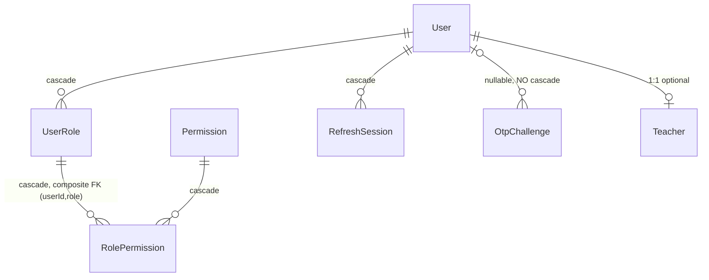

# Phase 2 — Schema: `auth-identity`

Models: `User` (auth columns), `OtpChallenge`, `RefreshSession`, `UserRole`, `RolePermission`,
`Permission`. Source: `apps/api/prisma/schema.prisma`. Service: `modules/auth/auth.service.ts`.

## 2.1 Structure

### `User` — auth-relevant columns (`schema.prisma:177-217`)

| Field | Type | Required | Default | Index | Notes |
| --- | --- | --- | --- | --- | --- |
| `id` | String | ✅ | `cuid()` | PK | |
| `phone` | String | ✅ | — | **`@unique`** (:179) | the login identifier; no password column anywhere |
| `email` | String? | ❌ | — | **none** | not unique — two users may share an email |
| `status` | UserStatus | ✅ | `ACTIVE` | none | `ACTIVE\|SUSPENDED\|DELETED` (:20-24) |
| `locale` | String | ✅ | `"fa"` | none | free string, not the `localeSchema` enum in contracts |
| `timezone` | String | ✅ | `"Asia/Tehran"` | none | free string, never validated on write (see Phase 4) |
| `createdAt`/`updatedAt` | DateTime | ✅ | `now()`/`@updatedAt` | none | |

`status` is the soft-delete flag: `DELETED` is a state, not a row removal. There is **no
`deletedAt`**, so the time of deletion is unrecoverable.

### `OtpChallenge` (`schema.prisma:261-274`)

| Field | Type | Required | Default | Index | Notes |
| --- | --- | --- | --- | --- | --- |
| `id` | String | ✅ | `cuid()` | PK | |
| `userId` | String? | ❌ | — | none | nullable: a challenge precedes user creation on first login |
| `phone` | String | ✅ | — | `@@index([phone, createdAt])` (:273) | |
| `codeHash` | String | ✅ | — | none | HMAC-SHA256 under a pepper derived from `JWT_ACCESS_SECRET` |
| `expiresAt` | DateTime | ✅ | — | **none** | no TTL/partial index; expired rows accumulate forever |
| `attempts` | Int | ✅ | `0` | none | brute-force counter |
| `resendAfter` | DateTime | ✅ | — | none | resend throttle |
| `verifiedAt` | DateTime? | ❌ | — | none | single-use marker |

`onDelete` is **unset** on `user` (:264), so it defaults to `SetNull` for an optional relation —
deleting a user leaves orphaned challenges rather than cascading. Contrast `RefreshSession`, which
does cascade.

### `RefreshSession` (`schema.prisma:245-259`)

| Field | Type | Required | Index | Notes |
| --- | --- | --- | --- | --- |
| `id` | String | ✅ | PK | doubles as the public half of the refresh token |
| `userId` | String | ✅ | `@@index([userId, familyId])` (:258) | `onDelete: Cascade` (:248) |
| `familyId` | String | ✅ | ↑ same index | rotation family; reuse revokes the whole family |
| `tokenHash` | String | ✅ | **none** | plain SHA-256 of the 32-byte secret — deliberate, documented `auth.service.ts:7` |
| `expiresAt` | DateTime | ✅ | **none** | 30 days (`auth.service.ts:28`); no TTL sweep |
| `replacedById` | String? | ❌ | none | rotation chain; **not a declared FK**, just a loose string |
| `revokedAt` | DateTime? | ❌ | none | |
| `ip`, `userAgent` | String? | ❌ | none | PII — see Phase 7 |

### RBAC triple: `Permission` / `UserRole` / `RolePermission` (`schema.prisma:219-243`)

| Model | PK | Notes |
| --- | --- | --- |
| `Permission` | `id`, `key` `@unique` (:221) | catalogue of permission strings |
| `UserRole` | **composite `@@id([userId, role])`** (:232) | grants a `Role` enum value to a user; cascades from User |
| `RolePermission` | **composite `@@id([userId, role, permissionId])`** (:242) | grants one permission within one of that user's roles |

The composite PKs are the right choice — they make "the same role twice for one user"
unrepresentable without a separate unique index.

Note the shape: `RolePermission` is keyed by `(userId, role, permissionId)`, so permissions are
granted **per user per role**, not per role globally. There is no notion of "every ADMIN has
`roles.manage`"; each admin carries their own grant rows. Consequences in Phase 3.

### Enums

`Role` (:10-18) = `STUDENT|TEACHER|ADMIN|STAFF|EXAMINER|SUPPORT|FINANCE` — 7 values.
`UserStatus` (:20-24) = `ACTIVE|SUSPENDED|DELETED`.

No hooks, no virtuals, no discriminators — Prisma has no equivalent and none are emulated.
No TTL indexes (PostgreSQL has none); no partial indexes anywhere in the schema.

## 2.2 Relationship diagram

All relations are **referenced** (foreign keys). Nothing embedded, nothing denormalized in this
domain — correct for a relational store.

## 2.3 Read/write profile

| Entity | Read by | Written by | Cardinality | Growth | Profile |
| --- | --- | --- | --- | --- | --- |
| `User` | every authenticated request indirectly; `/users/me`, `/admin/users`, `/admin/users/:id`, `search` | `POST /auth/otp/verify` (create on first login), `PUT /users/me`, `PATCH /admin/users/:id/{roles,status}` | 1 per human | linear with signups | **read-heavy** |
| `OtpChallenge` | `POST /auth/otp/verify` | `POST /auth/otp/request`, `/auth/otp/resend`, verify (sets `verifiedAt`, increments `attempts`) | **≫ users** — one row per OTP request, never deleted | fastest-growing table in the domain | **write-heavy, append-only in practice** |
| `RefreshSession` | `POST /auth/refresh` | login, every refresh (rotation creates a new row), logout | 1 per login × 30-day retention; a daily user creates ~1 row per access-token expiry (15 min) | high | **write-heavy** |
| `UserRole` | `AccessGuard` at issuance (`auth.service.ts:28`), `/admin/roles` | `/admin/roles`, `/admin/roles/revoke`, `/admin/users/:id/roles` | ~1–2 per user | flat | **read-heavy** |
| `RolePermission` | issuance only (`auth.service.ts:28`) | `/admin/permissions/grant` | small; staff only | flat | **read-heavy** |
| `Permission` | `/admin/permissions` | seed only (`prisma/seed.ts`) | ~15 rows | static | **read-only** |

Roles and permissions are read **once per token issuance**, not per request: `createSession`
(`auth.service.ts:28`) flattens them into the JWT claims. Every request thereafter reads them from
the token, which is why `TokenRevocationService` exists.

### Growth hazard — `OtpChallenge` and `RefreshSession` never shrink

Neither table has a deletion path. `grep -rn "otpChallenge.delete\|refreshSession.delete"` over
`apps/api/src` returns **nothing** — only `updateMany` setting `revokedAt`
(`auth.service.ts:30`). Both tables grow monotonically:

- `OtpChallenge`: one row per OTP request, including every failed and abandoned login.
- `RefreshSession`: one row per rotation, so an active daily user generates ~96 rows/day
  at a 15-minute access-token lifetime.

Neither `expiresAt` is indexed, so even a future cleanup job would sequential-scan. At 10k daily
actives this is ~1M `RefreshSession` rows/month with no reclamation. **F-201**, severity medium
(operational, assessed for cost in Phase 5).

## Findings

| ID | Sev | Title | Evidence |
| --- | --- | --- | --- |
| F-201 | medium | `OtpChallenge` and `RefreshSession` grow without bound — no delete path, no TTL, `expiresAt` unindexed | `schema.prisma:245-274`; no `.delete` call in `apps/api/src` |
| F-202 | low | `User.email` is neither unique nor indexed, while `phone` is unique — two accounts may hold the same email | `schema.prisma:181` vs `:179` |
| F-203 | low | `OtpChallenge.userId` has no `onDelete` rule (defaults to `SetNull`) while `RefreshSession` cascades — inconsistent deletion semantics | `schema.prisma:264` vs `:248` |
| F-204 | low | `RefreshSession.replacedById` models the rotation chain as an unconstrained string, not a FK — a dangling id is undetectable | `schema.prisma:252` |
