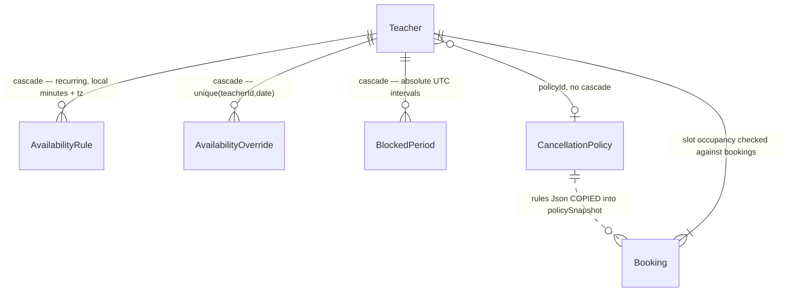

# Phase 2 — Schema: `availability`

Models: `AvailabilityRule`, `AvailabilityOverride`, `BlockedPeriod`, `CancellationPolicy`.
Service: `modules/bookings/availability.service.ts`.

This domain answers the brief's "recurring rules (RRULE) vs materialized slots" question directly:
LingoSpeak stores **recurring weekly rules plus per-date overrides plus absolute blocked
intervals**, and materialises slots on demand in `availability.service.ts:186-236`. No slot rows
are ever persisted.

## 2.1 Structure

### `AvailabilityRule` (`schema.prisma:415-428`) — the recurring layer

| Field | Type | Required | Default | Index | Notes |
| --- | --- | --- | --- | --- | --- |
| `teacherId` | String | ✅ | — | `@@index([teacherId, weekday])` (:427) | `onDelete: Cascade` |
| `weekday` | Int | ✅ | — | ↑ | 0–6, validated in code only (`availability.service.ts:87`) |
| `startMinute` | Int | ✅ | — | none | **minutes from local midnight**, 0–1440 |
| `endMinute` | Int | ✅ | — | none | ↑ |
| `timezone` | String | ✅ | — | none | **per-rule IANA zone**, free string |
| `lessonDuration` | Int? | ❌ | — | none | overrides `Teacher.lessonDuration` |
| `breakMinutes` | Int? | ❌ | — | none | overrides `Teacher.breakMinutes` |
| `active` | Boolean | ✅ | `true` | none | soft disable |

Storing wall-clock minutes + an IANA timezone (rather than UTC instants) is **correct** for
recurring availability: it is what makes "I teach 09:00–17:00 Tehran time" survive a DST
transition. The conversion to an instant happens at `availability.service.ts:28-32` via
`fromZonedTime`. This is the right layer for it.

No uniqueness constraint prevents overlapping rules for the same weekday; overlap is rejected in
application code only (`availability.service.ts:65-77`), and `setRules` replaces the whole set
inside a transaction (`:78-82`), which makes that check sound for the normal path.

### `AvailabilityOverride` (`schema.prisma:430-443`) — per-date exceptions

| Field | Type | Required | Index | Notes |
| --- | --- | --- | --- | --- |
| `teacherId` | String | ✅ | **`@@unique([teacherId, date])`** (:441) + redundant `@@index([teacherId, date])` (:442) | cascade |
| `date` | DateTime | ✅ | ↑ | midnight-UTC date key (`utcDate`, `availability.service.ts:24-27`) |
| `startMinute`/`endMinute` | Int? | ❌ | none | null when `available = false` |
| `available` | Boolean | ✅ | none | `false` = day off; `true` = replacement hours |
| `adminOverride` | Boolean | ✅ (`false`) | none | **written nowhere** — see F-243 |

**`@@unique([teacherId, date])` and `@@index([teacherId, date])` are the same columns in the same
order.** In PostgreSQL the unique constraint already creates a B-tree index, so the second
declaration is a pure duplicate: extra write cost and storage for zero read benefit. **F-241.**

The unique key also caps a teacher at **one override per date** — a teacher cannot say "free
09:00–11:00 and 15:00–17:00" on a specific date, only one contiguous range. Phase 3.

### `BlockedPeriod` (`schema.prisma:445-457`) — absolute intervals

| Field | Type | Required | Index | Notes |
| --- | --- | --- | --- | --- |
| `teacherId` | String | ✅ | `@@index([teacherId, startsAt, endsAt])` (:456) | cascade |
| `startsAt`/`endsAt` | DateTime | ✅ | ↑ | **absolute UTC instants**, unlike the rule layer |
| `adminCreated` | Boolean | ✅ (`false`) | none | actually written (`availability.service.ts:176`) |

Overlap between blocks is rejected in code (`availability.service.ts:174-175`) with a
`findFirst`-then-`create` **read-then-write and no transaction or constraint** — two concurrent
block creations can both pass. Low impact (a teacher racing themselves), noted for Phase 6.

### `CancellationPolicy` (`schema.prisma:405-413`)

| Field | Type | Required | Default | Notes |
| --- | --- | --- | --- | --- |
| `titleFa`/`titleEn` | String | ✅ | — | |
| `rules` | **Json** | ✅ | — | refund tiers: `{tiers:[{beforeHours,refundPercent}]}` |
| `active` | Boolean | ✅ | `true` | |
| `approvedById` | String? | ❌ | — | **loose string, no FK** |

`rules` is schemaless `Json`. `bookings.service.ts:25-35` (`refundTiers`) defends against that
comprehensively — non-object, array, null, and malformed tier entries all degrade to `[]` rather
than throwing, with a comment recording that reaching for `.tiers` directly used to crash
cancellation outright. That is good defensive code around a weak schema, not a good schema.

Critically, the policy is **snapshotted onto each booking** at creation
(`bookings.service.ts:104`: `policySnapshot: teacher.policy?.rules ?? {}`), so later policy edits
cannot retroactively change the refund a student was promised. That is the correct call.

## 2.2 Relationship diagram

Three different time representations coexist deliberately:
recurring local minutes (`AvailabilityRule`), a date key at UTC midnight
(`AvailabilityOverride.date`), and absolute instants (`BlockedPeriod`, `Booking`). Each is
appropriate to its layer, but the reconciliation between them lives entirely in
`availability.service.ts` and is the most intricate logic in the codebase.

## 2.3 Read/write profile

| Entity | Read by | Written by | Cardinality | Growth | Profile |
| --- | --- | --- | --- | --- | --- |
| `AvailabilityRule` | `GET /availability/:teacherId/slots` (**public**), `GET /availability/me`, `assertSlotAvailable` on every booking and reschedule | `PUT /availability/me/rules` (full replace) | ~7–20 per teacher | flat | **read ≫ write** |
| `AvailabilityOverride` | ↑ same three | `POST`/`DELETE /availability/me/overrides` | ≤ 1 per teacher per date | linear with time, **never pruned** | read-heavy |
| `BlockedPeriod` | ↑ same three | `POST`/`DELETE /availability/me/blocks`, `/availability/admin/blocks` | low | linear, **never pruned** | read-heavy |
| `CancellationPolicy` | booking creation (snapshot) | admin/seed only | ~5 rows | static | **read-only** |

`GET /availability/:teacherId/slots` is `@Public()` (`routes.json`) and unauthenticated. It loads
rules, up to 31 days of overrides, blocked periods and bookings in one query
(`availability.service.ts:195-203`), then generates slots in a nested loop (`:211-234`). The range
is capped at 31 days (`:267`). No caching. Cost assessed in Phase 5.

Neither `AvailabilityOverride` nor `BlockedPeriod` has any retention policy: rows for dates years
past remain and are filtered by predicate at read time (`:48`, `:53` use a `-7 days` floor, so old
rows are excluded from `GET /availability/me` but never deleted).

## Findings

| ID | Sev | Title | Evidence |
| --- | --- | --- | --- |
| F-241 | low | `AvailabilityOverride` declares `@@unique([teacherId, date])` **and** `@@index([teacherId, date])` — identical columns; the index is fully redundant with the constraint's implicit B-tree | `schema.prisma:441-442` |
| F-242 | low | One override per teacher per date (unique key) makes split availability on a specific date unrepresentable | `schema.prisma:441` |
| F-243 | low | `AvailabilityOverride.adminOverride` is declared and defaulted but never written — a dead field; the admin path writes `BlockedPeriod.adminCreated` instead | `schema.prisma:439`; `availability.service.ts:136-137,176` |
| F-244 | low | `CancellationPolicy.rules` is untyped `Json` and `approvedById` is a loose string with no FK; correctness rests entirely on the defensive `refundTiers` parser | `schema.prisma:405-413`; `bookings.service.ts:25-35` |
| F-245 | low | Blocked-period overlap check is read-then-write with no transaction or exclusion constraint | `availability.service.ts:174-176` |
