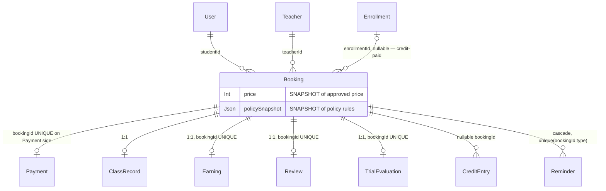

# Phase 2 — Schema: `bookings`

Models: `Booking`, `ClassRecord`, `Reminder`. Service: `modules/bookings/bookings.service.ts`.
`Booking` is the transactional centre of the platform: it is the join point between teachers,
students, payments, credits, earnings and reviews.

## 2.1 Structure

### `Booking` (`schema.prisma:459-500`)

**Core**

| Field | Type | Required | Default | Index | Notes |
| --- | --- | --- | --- | --- | --- |
| `id` | String | ✅ | `cuid()` | PK | |
| `studentId` | String | ✅ | — | `@@index([studentId, startsAt, endsAt])` (:499) | FK, no cascade |
| `teacherId` | String | ✅ | — | `@@index([teacherId, startsAt, endsAt])` (:498) | FK, no cascade |
| `enrollmentId` | String? | ❌ | — | **none** | set when paid with package credit |
| `startsAt` | DateTime | ✅ | — | ↑ both composites | **absolute UTC instant** |
| `endsAt` | DateTime | ✅ | — | ↑ | **derived** from `startsAt + duration`, stored |
| `timezone` | String | ✅ | — | none | the zone the lesson was *quoted* in; used for display and SMS |
| `type` | String | ✅ | — | none | **free string** — `'trial'` / `'regular'`, **not an enum** |
| `status` | BookingStatus | ✅ | `PENDING_PAYMENT` | **none** | 6 states |
| `price` | Int | ✅ | — | none | **denormalized snapshot** of the approved price, in toman |
| `policySnapshot` | Json | ✅ | — | none | **denormalized copy** of `CancellationPolicy.rules` |
| `paymentExpiresAt` | DateTime? | ❌ | — | **none** | 15-minute payment window |
| `meetingUrl` | String? | ❌ | — | none | |
| `attendanceStudent`/`attendanceTeacher` | Boolean? | ❌ | — | none | **tri-state** (null = not recorded) |
| `cancelledAt`/`cancellationReason` | DateTime?/String? | ❌ | — | none | |

**Mutual-reschedule block** (`:484-487`, added by migration `20260730095059_mutual_reschedule`)

`reschedulerId`, `rescheduleStartsAt`, `rescheduleTimezone`, `rescheduleAskedAt` — four nullable
columns holding a pending proposal, cleared together on accept/decline
(`bookings.service.ts:315`, `:349`). Only one proposal can be outstanding at a time, and the
schema comment (`:480-483`) records that either party may propose but only the counterparty may
accept — enforced at `bookings.service.ts:294`.

**Two denormalized copies, both correct:**

- `price` is captured at booking time from `Teacher.approvedTrialPrice`/`approvedRegularPrice`
  (`bookings.service.ts:90,103`). `payments.service.ts:69` then charges `booking.price` rather than
  re-reading the teacher, with a comment (`:63-68`) explaining that re-reading both re-quoted the
  student mid-flow and risked using the *unapproved* draft price. The earning is computed from the
  same figure. **This copy has no update path and needs none** — that is the point of a snapshot.
- `policySnapshot` freezes the refund tiers so a later policy edit cannot change an
  already-promised refund (`bookings.service.ts:104,205`).

Both are the "denormalized copy" the brief flags as a hazard, and both are the *justified* kind:
they are immutable-by-intent price/terms snapshots, not caches of mutable data.

**`type` as a free `String` is not justified.** `BookingStatus` is an enum (`:43-50`) but `type` is
not, despite having exactly two values, being compared as a string literal in at least six places
(`bookings.service.ts:73,74,90,155,159,180`), and being narrowed to `'trial'|'regular'` in the
TypeScript signature at `:48`. The DB will accept `'Trial'`, `'TRIAL'`, or anything else. **F-251.**

**`status` is unindexed.** Every lifecycle query filters on it — `assertSlotAvailable` uses
`status IN (PENDING_PAYMENT, CONFIRMED)` with `teacherId` and a time range
(`availability.service.ts:261`), which the `[teacherId, startsAt, endsAt]` index partially serves;
but admin listings and the student-overlap check filter status without a covering index. Phase 5.

**`paymentExpiresAt` is unindexed**, which matters because F-101 (orphaned `PENDING_PAYMENT`
bookings) can only be repaired by a sweep over exactly that column.

### `ClassRecord` (`schema.prisma:502-508`)

| Field | Type | Required | Index | Notes |
| --- | --- | --- | --- | --- |
| `bookingId` | String | ✅ | **`@unique`** (:504) | strict 1:1 |
| `notes` | String? | ❌ | none | teacher's lesson notes |
| `completedAt` | DateTime? | ❌ | none | |

A 1:1 satellite holding two nullable columns. It is upserted on completion
(`bookings.service.ts:389`). `completedAt` duplicates information already implied by
`Booking.status = COMPLETED`; `notes` is the only field that genuinely needs a home. **F-252.**

### `Reminder` (`schema.prisma:1085-1095`)

| Field | Type | Required | Default | Index | Notes |
| --- | --- | --- | --- | --- | --- |
| `bookingId` | String | ✅ | — | **`@@unique([bookingId, type])`** (:1094) | `onDelete: Cascade` |
| `type` | String | ✅ | — | ↑ | `'24h'` / `'1h'` — **free string** |
| `scheduledAt` | DateTime | ✅ | — | **none** | |
| `status` | String | ✅ | `"scheduled"` | **none** | **free string**, not an enum |
| `attempts` | Int | ✅ | `0` | none | |

`@@unique([bookingId, type])` is what makes `scheduleBooking`'s upsert idempotent
(`queue.service.ts:85`) — a correct use of a DB constraint to carry an invariant.
`status` as a free string is the same defect as `Booking.type`.

### Enums

`BookingStatus` (`:43-50`): `PENDING_PAYMENT|CONFIRMED|COMPLETED|CANCELLED|NO_SHOW|REFUNDED`.

`REFUNDED` is declared but — per the cancellation path — never written: `cancel()` sets
`CANCELLED` (`bookings.service.ts:207`) and moves the *payment* to `REFUNDED`/`PARTIALLY_REFUNDED`
(`:227`). Flagged for confirmation in Phase 4 as a possible dead enum value.

## 2.2 Relationship diagram

`Booking` has **five** 1:1 satellites, four of them enforced by a `@unique` on the child's
`bookingId` (`Payment:633`, `ClassRecord:504`, `Earning:751`, `Review:378`, `TrialEvaluation:569`).
`Reminder` alone is 1:many, keyed by `(bookingId, type)`.

Only `Reminder` cascades on booking delete. The other four would block deletion — appropriate for
financial records, and consistent with the schema's general stance that money-adjacent rows are
never removed.

## 2.3 Read/write profile

| Entity | Read by | Written by | Cardinality | Growth | Profile |
| --- | --- | --- | --- | --- | --- |
| `Booking` | `GET /bookings/me`, `GET /bookings/students`, `GET /admin/bookings`, `assertSlotAvailable` (**every booking attempt and every public slot listing**), `search`, `learning`, `payouts`, `teachers.service` | `POST /bookings`, `/cancel`, `/reschedule{,/accept,/decline}`, `/attendance`, `/complete`, payment settle (`payments.service.ts:268`), expiry job (`queue.service.ts:80`) | the platform's highest-volume business entity | linear with lessons sold | **balanced, contention-heavy** |
| `ClassRecord` | teacher panel | `complete()` upsert | 1 per completed booking | ↑ | write-once |
| `Reminder` | reminder worker | `scheduleBooking` upsert; worker status update | ≤ 2 per booking | 2× bookings | **write-heavy**, never pruned |

`Booking` is read on paths the writer does not control: **every public
`GET /availability/:teacherId/slots` call scans this table** for the requested window
(`availability.service.ts:201`), and every booking attempt counts overlapping rows twice
(`:261` for the teacher, `bookings.service.ts:68` for the student). Both are served by the two
composite indexes, which are well chosen for exactly this access pattern.

`Reminder` grows at 2 rows per booking with no deletion path (same class of problem as F-201) and
has no index on `scheduledAt` or `status`.

## Findings

| ID | Sev | Title | Evidence |
| --- | --- | --- | --- |
| F-251 | medium | `Booking.type` is a free `String` with two real values, compared as string literals in 6+ places, while the sibling `status` is a proper enum | `schema.prisma:470`; `bookings.service.ts:73,74,90,155,159,180` |
| F-252 | low | `ClassRecord` is a 1:1 satellite whose `completedAt` duplicates `Booking.status = COMPLETED`; only `notes` justifies the table | `schema.prisma:502-508`; `bookings.service.ts:389` |
| F-253 | low | `Reminder.status` and `Reminder.type` are free strings, not enums; `scheduledAt`/`status` unindexed and rows are never pruned | `schema.prisma:1085-1095` |
| F-254 | low | `Booking.paymentExpiresAt` and `Booking.status` are unindexed, so the sweep that would repair F-101 has no index to use | `schema.prisma:471,474` |
| F-255 | low | `BookingStatus.REFUNDED` appears unwritten — cancellation sets `CANCELLED` and moves only the payment to `REFUNDED` | `schema.prisma:49`; `bookings.service.ts:207,227` |
