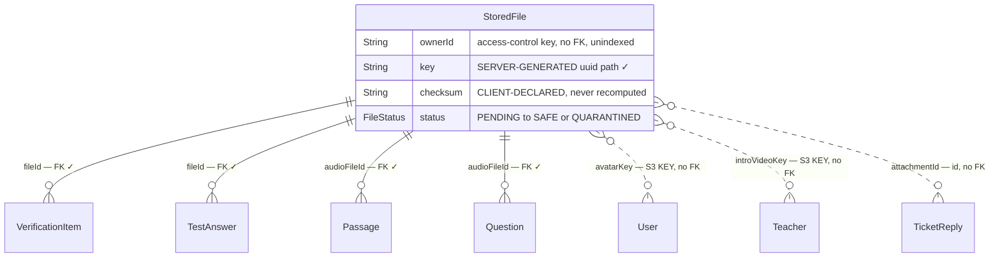

# Phase 2 — Schema: `files`

Model: `StoredFile`. Service: `modules/files/files.service.ts`. Storage: MinIO / S3 via
`@aws-sdk/client-s3` + presigned URLs.

One model, but it is the integrity hub for every uploaded artefact in the platform.

> **Correction note.** An earlier draft of this file claimed `FileStatus` had no driver and that
> `ownerId` was an unguarded authorization key. Both were wrong: `files.service.ts:104,111` drives
> the status machine and `:114-129` enforces ownership correctly. The findings below reflect the
> code as read.

## 2.1 Structure

### `StoredFile` (`schema.prisma:1025-1040`)

| Field | Type | Required | Default | Index | Notes |
| --- | --- | --- | --- | --- | --- |
| `id` | String | ✅ | `cuid()` | PK | |
| `ownerId` | String | ✅ | — | **none** | no `@relation` to `User`; used in every access check |
| `key` | String | ✅ | — | **`@unique`** (:1028) | **server-generated**, see below |
| `originalName` | String | ✅ | — | none | user-controlled, stored verbatim, **never used in the key** |
| `mimeType` | String | ✅ | — | none | validated against an allowlist on create |
| `size` | Int | ✅ | — | none | capped at 50 MB on create |
| `checksum` | String | ✅ | — | **none** | **client-declared SHA-256, never recomputed** |
| `status` | FileStatus | ✅ | `PENDING` | **none** | `PENDING\|SAFE\|QUARANTINED\|DELETED` |
| `purpose` | String | ✅ | — | **none** | free string |

### The upload state machine — implemented and sound

Contrary to what the bare schema suggests, `FileStatus` is genuinely driven:

| Step | Endpoint | Effect |
| --- | --- | --- |
| 1 | `POST /files/uploads` | validates mime allowlist (`:41-48`), size 0 < n ≤ 50 MB (`:49-56`), checksum **format** `/^[a-f0-9]{64}$/i` (`:57-59`); creates row `PENDING`; returns a 600 s presigned PUT (`:63-69`) |
| 2 | `POST /files/uploads/:id/content` | server-proxied upload; requires `{id, ownerId, status:'PENDING'}` (`:74`) and `checksum === file.checksum` (`:76`) |
| 3 | `POST /files/:id/complete` | `HeadObject` the stored object; if `ContentLength`, `ContentType` or `Metadata.checksum` disagree with the row → **`QUARANTINED`** (`:104`); else → **`SAFE`** (`:111`) |

**The object key is generated server-side** as
`${ownerId}/${purpose}/${randomUUID()}.${ext}` (`:60-61`), where `ext` is taken from the
user's filename but stripped to `[^a-z0-9]` and truncated to 8 chars. The user-supplied
`originalName` never reaches the key. **There is no path-traversal exposure and no
user-controlled filename in storage** — this is done correctly, and it is worth saying so
plainly given how often it is done wrong.

Download (`:114-134`) resolves the file with `status:'SAFE'` **and** an ownership disjunction:
`ownerId === requesterId`, or — only for `ADMIN`/`STAFF`/`EXAMINER` (`:115`) — a file attached to
a verification item, or to a test answer whose attempt is `UNDER_REVIEW` (`:122-125`). It returns a
300 s presigned GET rather than proxying bytes. That is a correct, tightly scoped authorization
check, and the reviewer branch is properly narrowed rather than being a blanket staff override.

### What `SAFE` actually means — and does not

The checksum is **supplied by the client** at step 1 and never recomputed from the bytes:

- On the proxied path, the server writes `Metadata.checksum` from `file.checksum` itself
  (`:85`), so step 3's metadata comparison compares the declared value against itself.
- On the presigned-PUT path the client sets both the bytes and the metadata.
- `body` is streamed straight to S3 (`:79-86`); it is never hashed.

So step 3 verifies **size and declared content-type consistency**, not content. A caller may
declare `application/pdf`, 1 MB, checksum X, and upload 1 MB of anything. There is also no
antivirus or content scanner anywhere in the project (no scanner dependency in
`apps/api/package.json`; the only queue is `notifications` and the only cron is reconciliation —
Phase 1 §1.3).

`FileStatus.SAFE` therefore asserts more than was checked. That matters because `download()` gates
on exactly `status:'SAFE'` (`:119`), and teacher verification documents and exam audio are served
through it. **F-2D2** (reworded from the incorrect original).

### Referential coverage — half-wired

Four inbound relations are proper foreign keys (`:1035-1038`):
`VerificationItem.fileId` (:348), `TestAnswer.fileId` (:923), `Passage.audioFileId` (:854),
`Question.audioFileId` (:869).

Four more file references elsewhere are **loose strings with no relation**:

| Column | Model | Evidence |
| --- | --- | --- |
| `avatarKey` | `User` | `schema.prisma:182` (F-213) |
| `introVideoKey` | `Teacher` | `:312` (F-225) |
| `attachmentId` | `TicketReply` | `:1132` (F-2C5) |
| `submission` | `Assignment` | `:626` — free text, not even a key (F-2B2) |

Exam and verification assets are tracked; **every profile and support artefact is not**. Note also
the split addressing convention: tracked references store a **file id**, untracked ones store a raw
**S3 key**. Two schemes for one store.

## 2.2 Relationship diagram

## 2.3 Read/write profile

| Entity | Read by | Written by | Cardinality | Growth | Profile |
| --- | --- | --- | --- | --- | --- |
| `StoredFile` | `GET /files/:id/download` (**authorization decision**), verification review, exam rendering | `POST /files/uploads` (`PENDING`), `/uploads/:id/content`, `/:id/complete` (`SAFE`/`QUARANTINED`) | 1 per upload | linear, **never pruned** | balanced |

All four file routes are authenticated-only with no `@Roles` (`routes.json`); the reviewer
distinction is made inside the service from `roles` (`:115`) rather than by a guard, which is the
right call here because ownership is the primary rule and role only widens it.

`GET /files/:id/download` is the **only file route with no `@RateLimit`** — the three write routes
all have one. Since it mints presigned URLs, an authenticated caller can enumerate ids without
throttling; each attempt is a single indexed lookup that fails closed, so the impact is limited to
scraping cost. Carried to Phase 7.

A three-step create means a row can be abandoned at `PENDING` at step 1 or 2. Nothing reclaims
them, and `status = DELETED` has no `deletedAt` and no S3 lifecycle link, so row state and object
state can diverge permanently.

## Findings

| ID | Sev | Title | Evidence |
| --- | --- | --- | --- |
| F-2D2 | medium | `checksum` is client-declared and never recomputed from the uploaded bytes, and no content/AV scanning exists — so `status = SAFE`, which `download()` gates on, asserts only size/type consistency | `files.service.ts:57-59,79-86,103-111,119`; no scanner in `apps/api/package.json` |
| F-2D5 | low | Three-step upload with no reclamation: abandoned `PENDING` rows and their S3 objects persist forever; `DELETED` has no `deletedAt` or lifecycle link | `files.service.ts:62,74,90`; `schema.prisma:1033` |
| F-2D1 | low | `StoredFile.ownerId` is unindexed and has no FK to `User`, though it is the column every access check filters on | `schema.prisma:1026`; `files.service.ts:74,91,121` |
| F-2D3 | low | Two addressing schemes for one store — tracked refs use `fileId` FKs, untracked ones (`avatarKey`, `introVideoKey`) store raw S3 keys | `schema.prisma:182,312` vs `:348,923` |
| F-2D4 | low | `checksum` unindexed and non-unique so it cannot dedupe; `purpose` is a free string used as a path segment in the object key | `schema.prisma:1032,1034`; `files.service.ts:61` |

**Assessed and found sound** (recorded so later phases do not re-flag them): server-generated
object keys with sanitized extensions, mime allowlist, 50 MB cap, ownership-scoped download with a
narrowly-scoped reviewer branch, short-lived presigned URLs (600 s up / 300 s down), and
`QUARANTINED` on metadata mismatch.
