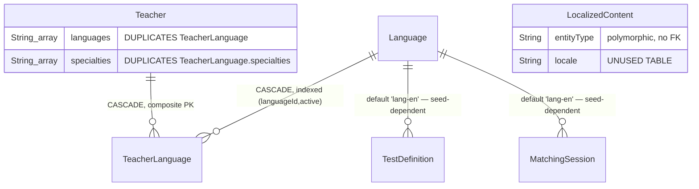

# Phase 2 — Schema: `languages`

Models: `Language`, `TeacherLanguage`, `LocalizedContent`. Service: `modules/languages/languages.service.ts`.

## 2.1 Structure

### `Language` (`schema.prisma:1139-1157`)

| Field | Type | Required | Default | Index | Notes |
| --- | --- | --- | --- | --- | --- |
| `id` | String | ✅ | `cuid()` | PK | **but referenced by the literal `"lang-en"` elsewhere** |
| `code` | String | ✅ | — | **`@unique`** (:1141) | ISO code |
| `nameFa`/`nameEn`/`nativeName` | String | ✅ | — | none | |
| `flag` | String? | ❌ | — | none | |
| `direction` | LanguageDirection | ✅ | `LTR` | none | `LTR\|RTL` |
| `active` | Boolean | ✅ | `true` | `@@index([active, order])` (:1156) | |
| `order` | Int | ✅ | `0` | ↑ | |
| `proficiencySystem` | ProficiencySystem | ✅ | `CEFR` | none | `CEFR\|CUSTOM` |

`@@index([active, order])` exactly matches the only read (`GET /languages`, public: active
languages in display order). Correctly indexed.

**The `id` is `cuid()` but two other models default their FK to the string literal `"lang-en"`** —
`TestDefinition.languageId` (`:813`) and `MatchingSession.languageId` (`:987`). A generated `cuid()`
never equals `"lang-en"`, so those defaults resolve only because the seed **explicitly** inserts the
row with that id, overriding the generator: `prisma/seed.ts:88` —
`['lang-en', 'en', 'انگلیسی', 'English', 'English', '🇬🇧', 'LTR', 10, 'CEFR']`.

So the defaults do work on a seeded database, and this is not a live fault. It is a **fragile
coupling**: a schema-level default depends on a literal in the seed script, with nothing tying them
together. If English were ever recreated through `POST /admin/languages` (which would generate a
`cuid()`), or the seed's id changed, both defaults would begin producing foreign-key violations on
insert — and the failure would surface in test creation and the matching wizard, far from the
cause. The seed leans on the same literal in three more places (`:125`, `:154`, `:271`).
**F-2E1**, severity low.

### `TeacherLanguage` (`schema.prisma:1159-1171`)

| Field | Type | Required | Default | Index | Notes |
| --- | --- | --- | --- | --- | --- |
| `teacherId` | String | ✅ | — | **composite `@@id([teacherId, languageId])`** (:1169) | cascade |
| `languageId` | String | ✅ | — | ↑ + `@@index([languageId, active])` (:1170) | cascade |
| `levels` | String[] | ✅ | `[]` | none | |
| `specialties` | String[] | ✅ | `[]` | none | **duplicates `Teacher.specialties`** |
| `active` | Boolean | ✅ | `true` | ↑ | |

A proper join table with a composite PK and both directions indexed (`teacherId` via the PK prefix,
`languageId` via the explicit index). This is the correct normalized shape.

It is undermined by **`Teacher.languages String[]`** (`:310`) holding the same relationship
denormalized, and **`Teacher.specialties String[]`** (`:309`) duplicating
`TeacherLanguage.specialties`. Two pairs of competing sources of truth, neither reconciled by any
constraint — the schema-side statement of F-221.

### `LocalizedContent` (`schema.prisma:1259-1272`)

| Field | Type | Required | Index | Notes |
| --- | --- | --- | --- | --- |
| `entityType` | String | ✅ | `@@unique([entityType, entityId, field, locale])` (:1269), `@@index([entityType, entityId])` (:1270) | **free string** |
| `entityId` | String | ✅ | ↑ | **polymorphic, no FK** |
| `field` | String | ✅ | ↑ | free string |
| `locale` | String | ✅ | ↑ + `@@index([locale])` (:1271) | free string, not the `fa\|en` enum |
| `value` | Json | ✅ | none | |

The doc comment (`:1257-1258`) states the intent plainly: scalable translations for additional
locales, with the existing fa/en columns kept as "the migration-safe fast path for core public
content".

That is a coherent strategy, but the schema shows it was **never adopted**. Every localizable model
still uses paired columns — `Teacher.nameFa/nameEn/bioFa/bioEn`, `Package.titleFa/En`,
`Notification.titleFa/En/bodyFa/En`, `CmsPage.titleFa/En/contentFa/En`, `TestDefinition.titleFa/En`
— and `LocalizedContent` appears in **no service's model-access list** (Phase 1 §1.6). It is a
fully-indexed, well-designed, entirely unused table. **F-2E2.**

The `@@unique([entityType, entityId, field, locale])` is the right key; `@@index([entityType,
entityId])` is a **redundant prefix** of it and buys nothing (same issue as F-241).

## 2.2 Relationship diagram

## 2.3 Read/write profile

| Entity | Read by | Written by | Cardinality | Growth | Profile |
| --- | --- | --- | --- | --- | --- |
| `Language` | `GET /languages` (**public, every page load for the switcher**), teacher directory filter, matching, tests | `POST/PATCH/DELETE /admin/languages` | ~5–20 rows | static | **read-only, ideal cache candidate** |
| `TeacherLanguage` | `GET /teachers` filter by language, teacher profile | teacher application/update | ~2 per teacher | slow | read-heavy |
| `LocalizedContent` | **nothing** | **nothing** | 0 | none | **dead** |

`Language` is a tiny, near-static, extremely hot table read on essentially every public request.
It has no caching layer in front of it (Redis is present but used for locks and rate limits only —
Phase 1 §1.4). Phase 5.

`DELETE /admin/languages/:id` is worth flagging: `TeacherLanguage` cascades from `Language`
(`:1163`), so deleting a language **silently removes every teacher's association with it**, while
`TestDefinition.languageId` and `MatchingSession.languageId` do **not** cascade and would block the
delete. The delete therefore either fails on an FK violation or destroys teacher data, depending on
which references exist. Phase 6.

## Findings

| ID | Sev | Title | Evidence |
| --- | --- | --- | --- |
| F-2E1 | low | Schema defaults `languageId = "lang-en"` depend on a literal id forced by `prisma/seed.ts:88`; works as seeded, but breaks silently if English is ever recreated with a generated `cuid()` | `schema.prisma:813,987` vs `:1140`; `prisma/seed.ts:88,125,154,271` |
| F-2E2 | low | `LocalizedContent` is fully designed and indexed but written and read by nothing; every model still uses paired fa/en columns | `schema.prisma:1259-1272`; absent from the Phase 1 model-access matrix |
| F-2E3 | medium | `TeacherLanguage` (normalized) is duplicated by `Teacher.languages String[]` and `Teacher.specialties String[]` with no reconciling constraint | `schema.prisma:309-310` vs `:1159-1171` |
| F-2E4 | low | `@@index([entityType, entityId])` is a redundant prefix of the `@@unique([entityType, entityId, field, locale])` constraint | `schema.prisma:1269-1270` |
| F-2E5 | low | Deleting a `Language` cascades away all `TeacherLanguage` rows while `TestDefinition`/`MatchingSession` block the delete — inconsistent and destructive | `schema.prisma:1163` vs `:814,988` |
