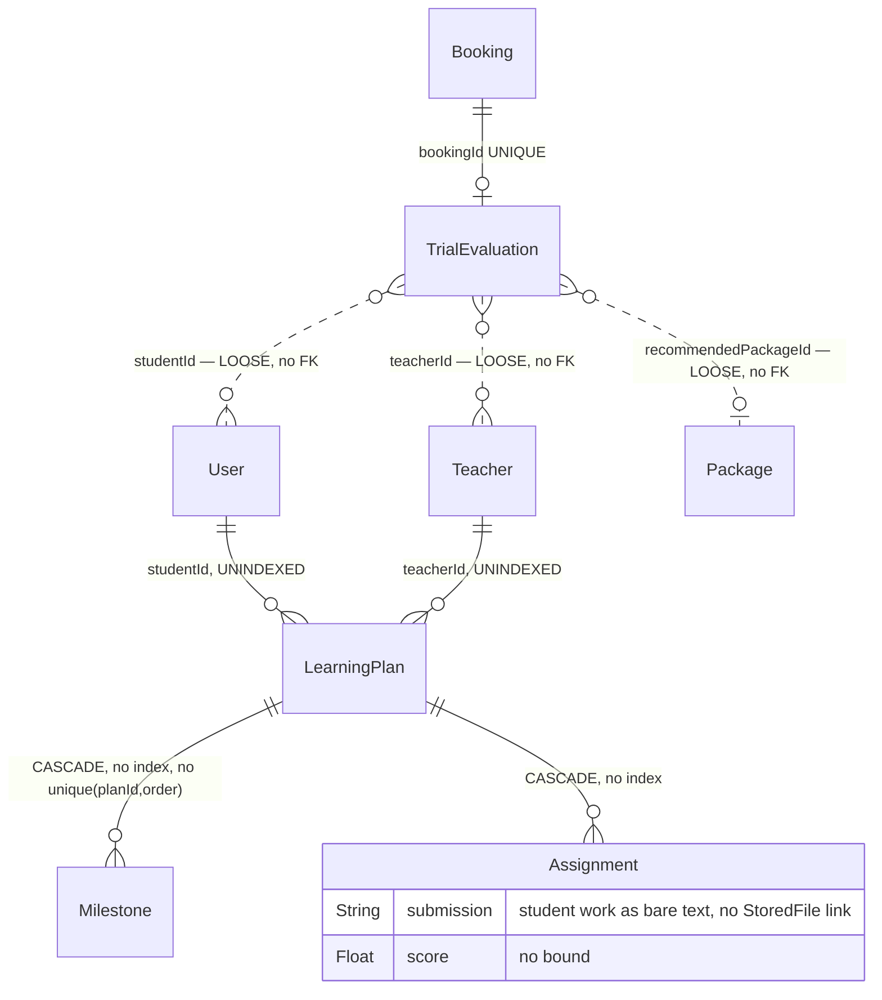

# Phase 2 — Schema: `learning`

Models: `LearningPlan`, `Milestone`, `Assignment`, `TrialEvaluation`.
Service: `modules/learning/learning.service.ts` (the most heavily minified file in the repo —
2,172-char lines, F-007).

## 2.1 Structure

### `LearningPlan` (`schema.prisma:591-606`)

| Field | Type | Required | Default | Index | Notes |
| --- | --- | --- | --- | --- | --- |
| `studentId` | String | ✅ | — | **none** | FK `@relation("StudentPlans")` |
| `teacherId` | String | ✅ | — | **none** | FK |
| `title` | String | ✅ | — | none | |
| `targetBand` | Float | ✅ | — | none | |
| `examDate` | DateTime? | ❌ | — | none | |
| `weakSkills` | String[] | ✅ | — | none | |
| `status` | String | ✅ | `"active"` | none | **free string, not an enum** |

**No indexes at all**, yet `GET /learning/plans` must filter by `studentId` or `teacherId` —
whichever the caller is. Both are unindexed. **F-2B1.**

### `Milestone` (`schema.prisma:608-616`)

`planId` (**cascade**), `title`, `dueAt?`, `completedAt?`, `order Int`.
**No index, and no `@@unique([planId, order])`** — unlike `TestSection`/`Question`, which both
guard their ordering. Duplicate orders within a plan are representable.

### `Assignment` (`schema.prisma:618-629`)

| Field | Type | Required | Default | Notes |
| --- | --- | --- | --- | --- |
| `planId` | String | ✅ | — | **cascade** |
| `title`, `instructions` | String | ✅ | — | |
| `dueAt` | DateTime? | ❌ | — | |
| `status` | String | ✅ | `"pending"` | **free string** |
| `submission` | String? | ❌ | — | **student's work stored as a bare String column** |
| `feedback` | String? | ❌ | — | |
| `score` | Float? | ❌ | — | no bound, no CHECK |

`submission String?` is the notable one: a student's assignment submission is an unbounded text
column with **no link to `StoredFile`**. `POST /learning/assignments/:id/submit` therefore cannot
accept a file attachment through the tracked file lifecycle — any upload would have to be an
out-of-band URL pasted into the string. Compare `TestAnswer`, which has a proper `fileId` FK
(`schema.prisma:922-923`). **F-2B2.**

`Assignment` also has **no index on `planId`** despite cascade being declared — cascade deletes
will sequential-scan.

### `TrialEvaluation` (`schema.prisma:567-578`)

| Field | Type | Required | Index | Notes |
| --- | --- | --- | --- | --- |
| `bookingId` | String | ✅ | **`@unique`** (:569) | FK — one evaluation per trial lesson |
| `teacherId` | String | ✅ | **none** | **loose string, no `@relation`** |
| `studentId` | String | ✅ | **none** | **loose string, no `@relation`** |
| `currentBand` | Float? | ❌ | none | |
| `weakSkills` | String[] | ✅ | none | |
| `notes` | String | ✅ | none | required |
| `recommendedPackageId` | String? | ❌ | none | **loose string, no FK** to `Package` |

`bookingId @unique` is correct and consistent with the other booking satellites. But
`teacherId`, `studentId` and `recommendedPackageId` are all bare strings with no foreign keys —
in a model whose *sibling* column `bookingId` is a proper FK. All three are already derivable by
joining through `Booking`, so they are **denormalized copies with no integrity guarantee and no
update path**. **F-2B3.**

## 2.2 Relationship diagram

Every dotted edge is a string column the database does not enforce. This domain has the **weakest
referential integrity in the schema**: four of its FK-shaped columns are not foreign keys.

## 2.3 Read/write profile

| Entity | Read by | Written by | Cardinality | Growth | Profile |
| --- | --- | --- | --- | --- | --- |
| `LearningPlan` | `GET /learning/plans` (student or teacher view) | `POST /learning/plans` (`@Roles('TEACHER')`) | ~1 per student-teacher pair | linear | balanced |
| `Milestone` | with the plan | plan creation/update | ~5 per plan | linear | write-once |
| `Assignment` | with the plan | `POST /learning/plans/:id/assignments`, `POST /learning/assignments/:id/submit` | ~10 per plan | linear | balanced |
| `TrialEvaluation` | teacher panel, package recommendation flow | `POST /learning/trial-evaluations` (`@Roles('TEACHER')`) | ≤ 1 per trial booking | linear with trials | write-once |

`learning.service.ts` also reads `booking` and `teacher` (Phase 1 §1.6) — cross-domain reach into
`bookings` and `teachers`, consistent with F-103/F-105.

`GET /learning/plans` is authenticated-only with **no `@Roles`** (`routes.json`), so it serves both
students and teachers from one handler and must branch on the caller's role internally. That makes
it an ownership-check site to verify in Phase 7 — it is in the 39-route authenticated-only set.

`POST /learning/assignments/:id/submit` is likewise authenticated-only with no role guard, despite
`POST /learning/plans` and `/plans/:id/assignments` both carrying `@Roles('TEACHER')`. A student
submitting is the intended use, so the missing guard is probably deliberate — but the **ownership**
check (is this assignment on a plan belonging to this student?) must then exist in the service.
Verified in Phase 7.

## Findings

| ID | Sev | Title | Evidence |
| --- | --- | --- | --- |
| F-2B1 | medium | `LearningPlan` has no indexes at all, yet `GET /learning/plans` filters by `studentId` or `teacherId`; `Milestone.planId` and `Assignment.planId` are also unindexed despite cascade deletes | `schema.prisma:591-629` |
| F-2B2 | low | `Assignment.submission` is a bare unbounded String with no `StoredFile` link, unlike `TestAnswer.fileId`, so submissions sit outside the tracked file lifecycle | `schema.prisma:626` vs `:922-923` |
| F-2B3 | medium | `TrialEvaluation.teacherId`, `studentId` and `recommendedPackageId` are denormalized copies with no foreign keys, in a model whose sibling `bookingId` is a proper FK | `schema.prisma:571-576` vs `:569-570` |
| F-2B4 | low | `LearningPlan.status` and `Assignment.status` are free strings with defaults but no enum; `Milestone` has no `@@unique([planId, order])` unlike comparable ordered models | `schema.prisma:601,625,615` |
