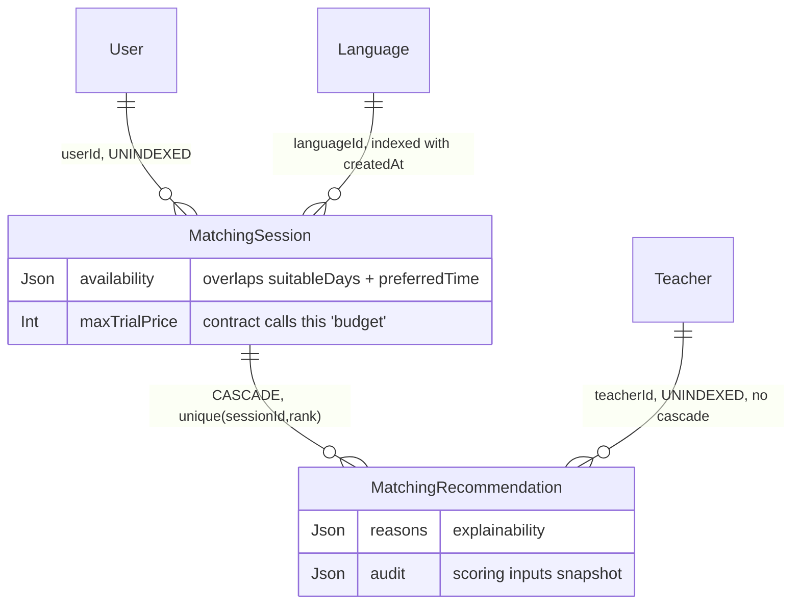

# Phase 2 — Schema: `matching`

Models: `MatchingSession`, `MatchingRecommendation`. Service: `modules/matching/matching.service.ts`.

A small, well-shaped domain: a student's stated preferences are captured as an immutable session
row, and the ranked teacher recommendations produced from it are stored as child rows with their
scoring rationale.

## 2.1 Structure

### `MatchingSession` (`schema.prisma:983-1008`)

| Field | Type | Required | Default | Index | Notes |
| --- | --- | --- | --- | --- | --- |
| `userId` | String | ✅ | — | **none** | FK |
| `languageId` | String | ✅ | `"lang-en"` | `@@index([languageId, createdAt])` (:1007) | FK; **hardcoded seed id as default** |
| `currentLevel`, `learningGoal`, `targetLevel` | String? | ❌ | — | none | free strings |
| `targetBand` | Float | ✅ | — | none | required |
| `currentBand` | Float? | ❌ | — | none | |
| `examDate` | DateTime? | ❌ | — | none | |
| `weakSkills` | String[] | ✅ | — | none | |
| `maxTrialPrice` | Int | ✅ | — | none | toman; the DTO calls this `budget` (`contracts:17`) |
| `availability` | **Json** | ✅ | — | none | free-form |
| `suitableDays` | Int[] | ✅ | `[]` | none | 0–6 |
| `preferredTime` | String? | ❌ | — | none | `morning\|afternoon\|evening` in the Zod schema only |
| `preferredTeacherGender` | String? | ❌ | — | none | free string |
| `trialRequired` | Boolean | ✅ | `true` | none | |
| `classType` | String | ✅ | `"private"` | none | free string |
| `timezone` | String | ✅ | — | none | |

**`availability Json` alongside `suitableDays Int[]` and `preferredTime String?`** is three
overlapping representations of "when can this student study". The Zod contract
(`packages/contracts/src/index.ts:18-19`) only defines `suitableDays` and `preferredTime` — it has
**no `availability` field at all**, so that column is populated from something other than the
validated contract, or not at all. **F-2A1**, confirmed in Phase 4.

Note the field-name mismatch: the contract sends `budget`
(`packages/contracts/src/index.ts:17`) while the column is `maxTrialPrice`. A rename happens
somewhere in the service — benign if intentional, but it is exactly the kind of drift F-004
describes.

`preferredTime`, `classType`, `preferredTeacherGender` are constrained to enums **in Zod only**
(`contracts:19-22`); the database accepts any string.

### `MatchingRecommendation` (`schema.prisma:1010-1023`)

| Field | Type | Required | Index | Notes |
| --- | --- | --- | --- | --- |
| `sessionId` | String | ✅ | part of `@@unique([sessionId, rank])` (:1022) | **cascade** |
| `teacherId` | String | ✅ | **none** | FK, no cascade |
| `rank` | Int | ✅ | ↑ unique | |
| `score` | Float | ✅ | none | |
| `reasons` | Json | ✅ | none | why this teacher was suggested |
| `audit` | Json | ✅ | none | **scoring inputs retained** |

`@@unique([sessionId, rank])` is a good constraint — it makes duplicate ranks within one session
unrepresentable.

Storing `reasons` and `audit` as JSON on each recommendation is a deliberate and commendable
choice: the ranking is explainable after the fact without re-running the algorithm against
teacher data that has since changed. This is the right pattern for a recommendation system.

## 2.2 Relationship diagram

## 2.3 Read/write profile

| Entity | Read by | Written by | Cardinality | Growth | Profile |
| --- | --- | --- | --- | --- | --- |
| `MatchingSession` | `GET /matching/history` (filters by `userId` — **unindexed**) | `POST /matching` | 1 per wizard completion | linear, **never pruned** | **append-only** |
| `MatchingRecommendation` | `GET /matching/history` (via session) | `POST /matching` (batch, ~5–10 rows) | ~5–10 per session | 5–10× sessions | **append-only** |

`POST /matching` reads `teacher` and `language` (per the model-access matrix) to score candidates.
The teacher scan it performs is the performance-relevant part and is assessed in Phase 5 — the
matching filters (`maxTrialPrice`, `preferredTeacherGender`, `suitableDays`, language) map onto
`Teacher` columns that are largely **unindexed** (`gender`, `approvedTrialPrice`) or array-valued
(`languages`, `targetBands`).

`MatchingSession.userId` being unindexed is the concrete defect here: `GET /matching/history` is
the only read path and it filters on exactly that column. The one index that exists,
`@@index([languageId, createdAt])` (:1007), serves an analytics query that no endpoint in
`routes.json` performs. **F-2A2** — an index that is present but unused, next to a query that has
none.

Both tables are append-only with no retention policy; a student who re-runs the wizard ten times
leaves ten sessions and ~80 recommendations permanently.

## Findings

| ID | Sev | Title | Evidence |
| --- | --- | --- | --- |
| F-2A1 | low | `MatchingSession.availability Json` overlaps `suitableDays Int[]` and `preferredTime`, and has no counterpart in the Zod contract that validates this endpoint | `schema.prisma:997-999`; `packages/contracts/src/index.ts:18-19` |
| F-2A2 | medium | `MatchingSession.userId` is unindexed although `GET /matching/history` filters on it; meanwhile `@@index([languageId, createdAt])` serves no endpoint | `schema.prisma:985,1007` |
| F-2A3 | low | `MatchingRecommendation.teacherId` unindexed; `preferredTime`/`classType`/`preferredTeacherGender` constrained in Zod only, not in the database | `schema.prisma:1014`, `:999-1002` |
| F-2A4 | low | Column named `maxTrialPrice` is populated from a contract field named `budget` — silent rename across the boundary | `schema.prisma:996`; `packages/contracts/src/index.ts:17` |
