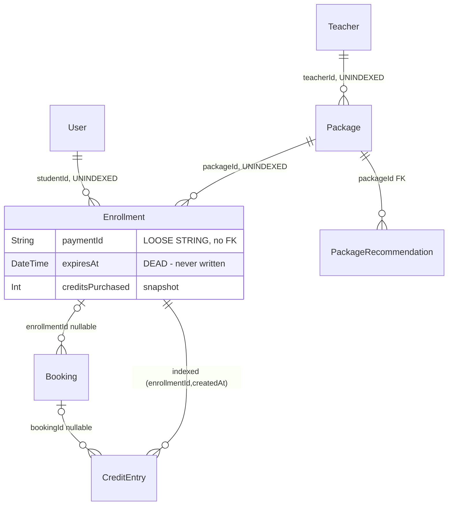

# Phase 2 — Schema: `packages`

Models: `Package`, `Enrollment`, `CreditEntry`, `PackageRecommendation`.
Service: `modules/commerce/packages/packages.service.ts`.

## 2.1 Structure

### `Package` (`schema.prisma:510-535`) — a teacher's sellable bundle

| Field | Type | Required | Default | Index | Notes |
| --- | --- | --- | --- | --- | --- |
| `teacherId` | String | ✅ | — | **none** | FK, no cascade |
| `titleFa`/`titleEn`, `descriptionFa`/`descriptionEn` | String | ✅ | — | none | fa/en as columns |
| `credits` | Int | ✅ | — | none | session count; constrained to `PACKAGE_TIERS` **in code only** (`:518-520`) |
| `lessonMinutes` | Int | ✅ | — | none | |
| `listPrice` | Int | ✅ | `0` | none | undiscounted total |
| `discountPercent` | Int | ✅ | `0` | none | |
| `price` | Int | ✅ | — | none | what the student pays |
| `active` | Boolean | ✅ | `true` | none | |
| `approvalStatus` | ReviewStatus | ✅ | `PENDING` | **none** | reuses the *review* enum |
| `approvedById` | String? | ❌ | — | none | loose string, no FK |

Three price columns with the invariant `price ≈ listPrice × (1 - discountPercent/100)` and no
constraint. `credits` is limited to `{1,5,10,15,20}` by `PACKAGE_TIERS`
(`packages/contracts/src/index.ts:37`), enforced in `PackagesService` — deliberately, per the
comment at `:518-520`, so adding a tier is a code change not a migration. Reasonable trade-off.

`approvalStatus` reuses `ReviewStatus` (`:36-41`, meant for *review moderation*) rather than the
purpose-built `DocumentStatus`/`PriceStatus`. Semantic overloading; `NEEDS_REVISION` is meaningless
for a package. **F-271.**

`teacherId` is **unindexed** despite `GET /packages/me` and `GET /packages/teacher/:teacherId`
(public) both filtering on it.

### `Enrollment` (`schema.prisma:537-550`) — a student's purchase

| Field | Type | Required | Default | Index | Notes |
| --- | --- | --- | --- | --- | --- |
| `studentId` | String | ✅ | — | **none** | FK |
| `packageId` | String | ✅ | — | **none** | FK |
| `creditsPurchased` | Int | ✅ | — | none | **denormalized** from `Package.credits` |
| `expiresAt` | DateTime? | ❌ | — | **none** | **never written — see F-272** |
| `active` | Boolean | ✅ | `true` | none | |
| `paymentId` | String? | ❌ | — | none | **loose string, no FK** to `Payment` |

`creditsPurchased` is a correct snapshot (the package's price/credits may change later).

`expiresAt` is declared, nullable, unindexed, and **not set** by the only creation site:
`payments.service.ts:272` creates the enrollment with `{studentId, packageId, creditsPurchased,
paymentId}` and no `expiresAt`. So package credits **never expire**, despite the schema modelling
expiry and `CreditEntryType` including an `EXPIRE` variant (`:89`). Both are dead. **F-272.**

`paymentId` as a loose string is inconsistent with the rest of the money domain and prevents
joining an enrollment to the payment that created it at the DB level.

### `CreditEntry` (`schema.prisma:552-565`) — the credit ledger

| Field | Type | Required | Index | Notes |
| --- | --- | --- | --- | --- |
| `enrollmentId` | String | ✅ | `@@index([enrollmentId, createdAt])` (:564) | FK |
| `bookingId` | String? | ❌ | **none** | nullable FK |
| `type` | CreditEntryType | ✅ | none | `PURCHASE\|RESERVE\|CONSUME\|RESTORE\|EXPIRE\|ADJUST` |
| `amount` | Int | ✅ | none | **signed** — `+credits` on purchase, `-1` on reserve |
| `idempotencyKey` | String | ✅ | **`@unique`** (:560) | |

A second append-only ledger, mirroring `WalletEntry`'s design: balance is
`SUM(amount)` (`bookings.service.ts:85`), never stored. Consistent and correct.

**But the sign convention differs from `WalletEntry`.** Here `amount` is signed
(`-1` at `bookings.service.ts:110`, `+1` at `:210`); in `WalletEntry` `amount` is always positive
with the sign carried by `direction`. Two ledgers, two conventions, one codebase. **F-273.**

`CONSUME` entries are written with **`amount: 0`** (`bookings.service.ts:392`) — the credit was
already deducted by the earlier `RESERVE`, so consumption is a marker with no balance effect. That
is defensible but makes `type` and `amount` semantically independent in a way nothing documents at
the schema level.

`EXPIRE` and `ADJUST` are declared enum values with no writer (consistent with F-272).

### `PackageRecommendation` (`schema.prisma:580-589`)

`teacherId`, `studentId`, `packageId` (**only `packageId` is a real FK** — `:585`; the other two
are loose strings), `reason`, `status String` default `"pending"`, `createdAt`. **No indexes at
all.** Mixed FK discipline within a single small model.

## 2.2 Relationship diagram

## 2.3 Read/write profile

| Entity | Read by | Written by | Cardinality | Growth | Profile |
| --- | --- | --- | --- | --- | --- |
| `Package` | `GET /packages/teacher/:teacherId` (**public**), `GET /packages/me`, checkout (`payments.service.ts:72,271`) | `POST /packages`, `POST /packages/:id/approval` | ~5 per teacher | slow | **read-heavy** |
| `Enrollment` | `GET /packages/enrollments/me`, booking with credit (`bookings.service.ts:79`) | `payments.service.ts:272` (fulfil) only | 1 per package sale | linear | balanced |
| `CreditEntry` | **credit balance on every credit-paid booking** (`bookings.service.ts:85` aggregate) | purchase, reserve, restore, consume | several per enrollment | linear | **append-only, read-amplified** |
| `PackageRecommendation` | teacher/student panel | trial evaluation flow | low | linear | balanced |

The credit-balance read (`bookings.service.ts:85`) aggregates **all** `CreditEntry` rows for the
enrollment on every credit-paid booking — the same read-amplification pattern as `walletBalance`,
but bounded here (an enrollment has ≤ ~40 entries), so it is not a practical concern.

## Findings

| ID | Sev | Title | Evidence |
| --- | --- | --- | --- |
| F-271 | low | `Package.approvalStatus` reuses `ReviewStatus` (review moderation), making `NEEDS_REVISION` meaningless for packages | `schema.prisma:530`; `:36-41` |
| F-272 | medium | `Enrollment.expiresAt` is never written and `CreditEntryType.EXPIRE`/`ADJUST` have no writer — package credits never expire despite the schema modelling expiry | `schema.prisma:544`, `:89`; `payments.service.ts:272` |
| F-273 | low | Two ledgers use opposite sign conventions: `CreditEntry.amount` is signed, `WalletEntry.amount` is positive-with-`direction` | `schema.prisma:559` vs `:674`; `bookings.service.ts:110` |
| F-274 | medium | `Package.teacherId`, `Enrollment.studentId` and `Enrollment.packageId` are unindexed despite being the only query keys, including on a public endpoint | `schema.prisma:512,539,541` |
| F-275 | low | `Enrollment.paymentId` and `PackageRecommendation.teacherId`/`studentId` are loose strings with no FK, inconsistent with sibling columns in the same models | `schema.prisma:548`, `:582-583` |
