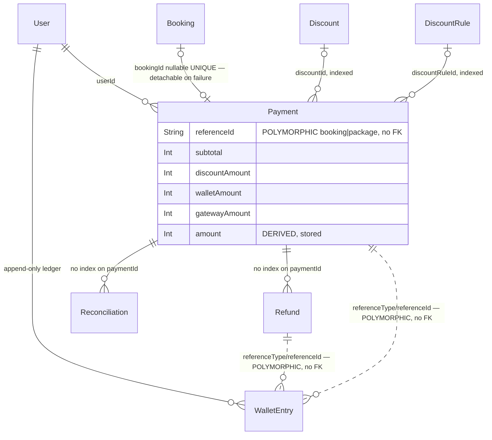

# Phase 2 — Schema: `payments`

Models: `Payment`, `Refund`, `Reconciliation`, `WalletEntry`, `Discount`, `DiscountRule`.
Services: `payments.service.ts`, `wallet.service.ts`, `refunds.service.ts`,
`reconciliation.service.ts`, `gateway.service.ts`, `discounts/*`.

**Money unit: toman**, integer minor units throughout. The ×10 conversion to rial happens only at
the Zarinpal boundary (`gateway.service.ts:8`, applied at `:25` and `:45`). No float, no decimal
string, no second currency. This is the correct answer to the brief's currency question and is
re-verified in Phase 6.

## 2.1 Structure

### `Payment` (`schema.prisma:631-665`)

| Field | Type | Required | Default | Index | Notes |
| --- | --- | --- | --- | --- | --- |
| `id` | String | ✅ | `cuid()` | PK | |
| `bookingId` | String? | ❌ | — | **`@unique`** (:633) | nullable + unique: one live payment per booking |
| `userId` | String | ✅ | — | **none** | FK |
| `purpose` | String | ✅ | — | none | **free string** — `'booking'` / package; not an enum |
| `referenceId` | String | ✅ | — | **none** | polymorphic target id (booking **or** package) — **no FK** |
| `subtotal` | Int | ✅ | — | none | toman |
| `discountAmount` | Int | ✅ | `0` | none | |
| `walletAmount` | Int | ✅ | `0` | none | portion paid from wallet |
| `gatewayAmount` | Int | ✅ | — | none | portion sent to Zarinpal |
| `amount` | Int | ✅ | — | none | `subtotal - discountAmount`; **derived and stored** |
| `status` | PaymentStatus | ✅ | `PENDING` | **none** | 6 states |
| `authority` | String? | ❌ | — | **`@unique`** (:645) | Zarinpal authority; the callback's lookup key |
| `gatewayReference` | String? | ❌ | — | none | Zarinpal `ref_id` |
| `idempotencyKey` | String | ✅ | — | **`@unique`** (:647) | **client-chosen** |
| `discountId` | String? | ❌ | — | `@@index([discountId])` (:663) | at most one of the two |
| `discountRuleId` | String? | ❌ | — | `@@index([discountRuleId])` (:664) | ↑ |
| `callbackPayload` | Json? | ❌ | — | none | raw gateway payload, audit |
| `verifiedAt` | DateTime? | ❌ | — | none | |

Five money columns (`subtotal`, `discountAmount`, `walletAmount`, `gatewayAmount`, `amount`) with
two arithmetic invariants — `amount = subtotal - discountAmount` and
`gatewayAmount = amount - walletAmount` (`payments.service.ts:104,112`) — and **no CHECK
constraint enforcing either**. Storing all five is defensible for auditability, but the invariants
live only in one function.

`bookingId String? @unique` is a genuinely clever encoding: nullable-unique lets a *failed*
payment be detached (`clearBookingPaymentSlot`, `payments.service.ts:145-156`) so a retry can claim
the slot, while the audit row survives with `referenceId` still pointing at the booking. PostgreSQL
permits repeated NULLs under a unique index, which is what makes it work.

`referenceId` is **polymorphic with no FK** — it is a booking id when `purpose = 'booking'` and a
package id otherwise (`payments.service.ts:60`, `:72`). Nothing at the DB level prevents a dangling
reference or a mismatched `purpose`. **F-261.**

`idempotencyKey` is client-supplied. `assertOwned` (`payments.service.ts:49-54`) correctly refuses
to return another user's payment on a guessed key — the key is unique **globally**, not per user,
so without that check a guessed key would disclose a stranger's payment.

### `WalletEntry` (`schema.prisma:667-683`) — the ledger

| Field | Type | Required | Index | Notes |
| --- | --- | --- | --- | --- |
| `userId` | String | ✅ | `@@index([userId, createdAt])` (:681) | FK |
| `transactionId` | String | ✅ | `@@index([transactionId])` (:682) | `tx_${referenceId}` — **not a FK, not unique** |
| `account` | String | ✅ | **none** | always `'user_wallet'` in practice — free string |
| `direction` | LedgerDirection | ✅ | none | `DEBIT\|CREDIT` |
| `amount` | Int | ✅ | none | **always positive**; sign carried by `direction` |
| `referenceType`/`referenceId` | String | ✅ | **none** | polymorphic, no FK |
| `idempotencyKey` | String | ✅ | **`@unique`** (:678) | the anti-double-credit guard |

**This is an append-only ledger with no stored balance column anywhere.** `walletBalance`
(`wallet.service.ts:8-13`) computes `SUM(CREDIT) - SUM(DEBIT)` via `groupBy` on every read. That is
the strong answer to the brief's "stored scalar vs derived ledger" question — LingoSpeak chose
derived, and there is no mutable balance to drift.

The cost is that **every balance read aggregates the user's entire lifetime history**, with only
`[userId, createdAt]` to serve a query that filters `(userId, account)` and groups by `direction`.
Assessed in Phase 5.

`amount Int` with sign in `direction` is the right ledger encoding — it makes a negative-amount row
meaningless rather than silently inverting a transaction.

### `Refund` (`schema.prisma:723-734`)

| Field | Type | Required | Default | Notes |
| --- | --- | --- | --- | --- |
| `paymentId` | String | ✅ | — | FK, **no index** |
| `amount` | Int | ✅ | — | |
| `reason` | String | ✅ | — | free text |
| `status` | String | ✅ | `"pending"` | **free string, and always written as `'completed'`** |
| `gatewayReference` | String? | ❌ | — | **never written — dead field** |
| `idempotencyKey` | String | ✅ | — | `@unique` (:731) |
| `approvedById` | String? | ❌ | — | loose string, no FK |

`gatewayReference` being declared but never written is the schema-level proof of the Phase 1
finding: **no refund path contacts the gateway.** All three writers set `status:'completed'`
immediately and credit `WalletEntry` — `bookings.service.ts:217-227`,
`payments.service.ts:291-300`, `refunds.service.ts:23-24`. The `"pending"` default is unreachable.

### `Reconciliation` (`schema.prisma:736-745`)

`paymentId` (FK, **no index**), `providerAmount`, `providerStatus`, `matched Boolean`,
`details Json?`. Written by the 10-minute cron (`reconciliation.service.ts:63`). Append-only,
never read by application code as far as the model-access matrix shows — an operator-facing table.

### `Discount` (`schema.prisma:685-696`) and `DiscountRule` (`:709-721`)

`Discount`: `code @unique` (:687), `type String` (free — `'percent'`/fixed, compared at
`payments.service.ts:88`), `value Int`, `maxUses Int?`, `usedCount Int` (**mutable counter**),
`startsAt`/`endsAt`, `active`.

`usedCount` is a **stored mutable counter**, incremented inside the checkout transaction
(`payments.service.ts:102`) and released by `releaseDiscount` on failure/expiry
(`payments.service.ts:248,301`; `queue.service.ts:83`). It is the one place in the money domain
where a derived value is stored as a scalar rather than computed — and unlike the wallet, it *can*
drift if any abort path is missed. Phase 6.

`DiscountRule` (automatic, currently `BIRTHDAY` only — `DiscountTrigger` at `:698-700`):
`trigger`, `type`, `value`, `maxAmount Int?`, `windowDays Int` (default 7), `active`,
`@@index([trigger, active])` (:720). Rows rather than a hardcoded branch — documented at `:702-708`
and a good call.

### Enums

`PaymentStatus` (:52-59): `PENDING|PAID|FAILED|EXPIRED|REFUNDED|PARTIALLY_REFUNDED`.
`LedgerDirection` (:79-82): `DEBIT|CREDIT`. `DiscountTrigger` (:698-700): `BIRTHDAY`.

`Refund.status` and `Discount.type` and `Payment.purpose` are all free strings where enums exist
elsewhere in the same file — the enum discipline is inconsistent across this domain.

## 2.2 Relationship diagram

Two polymorphic, FK-less reference pairs (`Payment.referenceId`,
`WalletEntry.referenceType/referenceId`) are the schema's main integrity gap in this domain.

## 2.3 Read/write profile

| Entity | Read by | Written by | Cardinality | Growth | Profile |
| --- | --- | --- | --- | --- | --- |
| `Payment` | `GET /payments/invoices`, `GET /admin/payments`, `GET /payments/callback` (by `authority`), reconciliation cron, `search`, `admin` | `POST /payments`, `POST /payments/:id/gateway`, callback settle, `failPayment`, expiry job, `returnCapture` | 1+ per booking/package sale | linear with sales | **write-heavy at checkout, read-heavy after** |
| `WalletEntry` | **every checkout** (`walletBalance`, twice — `payments.service.ts:105,123`), `GET /payments/wallet`, `GET /payments/wallet/transactions` | every refund, rollback, wallet debit | **several per user per transaction** | fastest-growing money table | **append-only, read-amplified** |
| `Refund` | `refunds.service.ts` aggregate (`:20`), admin | cancel, `returnCapture`, admin refund | ≤ payments | linear | write-once |
| `Reconciliation` | operators only | cron, per discrepancy | small | linear with discrepancies | **write-only from the app's view** |
| `Discount` | checkout | `usedCount` increment/decrement | small | flat | **read-heavy, hot counter** |
| `DiscountRule` | every checkout (`autoDiscounts.evaluate`, `payments.service.ts:93`) | admin | ~1 row | flat | read-only |

**Hot-row contention:** `Discount.usedCount` is incremented inside a `Serializable` transaction
(`payments.service.ts:102`). Every concurrent checkout using the *same* code contends on that one
row, and under `Serializable` losers abort with `P2034`. A popular promo code therefore serialises
all its checkouts. `settleVerified` retries `P2034` once (`:229-234`) but
`createPaymentRecord` **does not** — the user gets the 409 from `domain.exception.ts:60`.
Assessed in Phase 5/6.

## Findings

| ID | Sev | Title | Evidence |
| --- | --- | --- | --- |
| F-261 | medium | `Payment.referenceId` is polymorphic (booking id **or** package id) with no FK and no constraint tying it to `purpose`; dangling and mismatched references are representable | `schema.prisma:637-638`; `payments.service.ts:60,72` |
| F-262 | medium | `WalletEntry.referenceType`/`referenceId` are polymorphic with no FK and no index — the ledger cannot be joined back to its source rows by the database | `schema.prisma:676-677` |
| F-263 | medium | `Refund.gatewayReference` is declared but never written, and `status` is always `'completed'` — schema-level evidence that no refund reaches the gateway | `schema.prisma:729-730`; `refunds.service.ts:23`; `payments.service.ts:293`; `bookings.service.ts:219` |
| F-264 | low | `Payment.userId`, `Refund.paymentId`, `Reconciliation.paymentId` and `WalletEntry.account` are all unindexed despite being primary query keys | `schema.prisma:635,725,738,672` |
| F-265 | low | Five money columns carry two arithmetic invariants with no CHECK constraint; the invariants exist only in `createPaymentRecord` | `schema.prisma:639-643`; `payments.service.ts:104,112` |
| F-266 | low | `Payment.purpose`, `Refund.status`, `Discount.type` are free strings where enums are used elsewhere in the same schema | `schema.prisma:637,729,688` |

---

# Phase 3 — Design rationale: `payments`

## What this shape optimizes for

The access profile from §2.3 says: **write-once-then-read-forever, with a hostile
network in the middle.** A payment row is created once, mutated a handful of times along a known
state machine, and then read indefinitely for invoices, admin review and reconciliation. The
mutations arrive from an untrusted party (the user's browser returning from Zarinpal) and may
arrive twice, late, out of order, or never.

Every notable decision follows from that:

- **Idempotency keys on `Payment`, `Refund`, `WalletEntry`, `CreditEntry`** — unique columns, not
  application checks. The schema assumes every write may be replayed.
- **`authority @unique`** — the callback's only lookup key must be collision-free.
- **`bookingId String? @unique`** — nullable-unique so a failed attempt can be *detached*
  (`payments.service.ts:145-156`) rather than deleted, preserving audit while freeing the slot.
- **Five stored money columns** — the arithmetic is frozen at capture time so an invoice reprints
  identically years later, even after prices, discounts and commission rates change.
- **Ledger, not balance** — `walletBalance` is `SUM(CREDIT) − SUM(DEBIT)` (`wallet.service.ts:8-13`),
  so there is no mutable number to drift.

This shape assumes **payments are read far more often than written, and that correctness under
replay matters more than write throughput.** For a marketplace at this scale that is the right bet.

## Alternatives

| Alternative | How it would look here | Gains | Costs | Verdict for LingoSpeak |
| --- | --- | --- | --- | --- |
| **Wallet balance as a stored scalar** on `User` | `User.walletBalance Int`, updated in the same tx as each entry | O(1) balance read; no aggregate on every checkout | A mutable number that *will* drift; every bug becomes a money bug; reconciliation needs the ledger anyway | **Reject.** The current derived ledger is the correct choice and is the strongest decision in this domain. The read cost is real (F-5xx) but is fixable with a snapshot row, not by abandoning the ledger. |
| **Balance snapshot + ledger tail** (hybrid) | `WalletSnapshot(userId, balance, throughEntryId)` refreshed periodically; balance = snapshot + entries after it | Bounded aggregate regardless of history length; keeps the ledger authoritative | One more table; snapshot staleness logic | **Adopt when a user's ledger exceeds ~10k rows.** The correct evolution, not a redesign. |
| **Money as float** | `Float` columns | none | catastrophic rounding | **Reject** — and correctly already rejected. Integer toman throughout. |
| **Money as decimal string / `Decimal`** | `Decimal(12,0)` | exactness with sub-unit support | Iranian toman has no practical sub-unit; adds driver friction | **Reject.** Integer minor units are right for a single-currency IRR platform. |
| **Dual-currency storage** (`amount`, `currency`) | every money column paired with a currency code | multi-market ready | every comparison and sum needs a currency guard; no second market exists | **Reject for now.** Correctly deferred — but see Implications: `gateway.service.ts:8` is the only place that knows toman≠rial, and that is exactly where a currency column would go. |
| **One `payments` table with a status enum** (current) vs **separate tables per lifecycle stage** | `PendingPayment` / `CapturedPayment` / `RefundedPayment` | each table narrow; no impossible states | moving rows between tables is a distributed-transaction problem; ids change; audit becomes a union query | **Keep the status enum.** Correct for a state machine this small. |
| **`Refund` as a status on `Payment`** | drop the table, add `refundedAmount Int` | one fewer table | partial refunds need N rows; loses per-refund idempotency key, reason, approver | **Keep `Refund` as rows.** Correct. |
| **Polymorphic `referenceId`** (current) vs **nullable typed FKs** | `bookingId` + `packageId`, exactly one non-null, with a CHECK | real referential integrity; joinable | one nullable column per purpose; a new purpose means a migration | **Change.** With only two purposes, typed FKs are strictly better. This is F-261's fix. |
| **`Discount.usedCount` counter** vs **`COUNT(*)` over `Payment.discountId`** | derive from the indexed `@@index([discountId])` that already exists | no hot row; no release/rollback paths to get wrong; cannot drift | a count query per checkout | **Change.** The index needed is already there. The counter is the one stored aggregate in a domain that otherwise derives everything, and it needs three separate release paths (`payments.service.ts:248,301`; `queue.service.ts:83`) to stay correct. Deriving it deletes that entire class of bug. |
| **Redis as source of truth for the payment lock** | current: Redis only for `payment-gateway:{id}` mutual exclusion | — | — | **Sound as used.** Redis is an optimisation over the DB constraints, not a substitute; losing Redis degrades to contention, not to incorrectness. |

## Verdict per entity

| Entity | Verdict | Reason |
| --- | --- | --- |
| `Payment` | **acceptable, with caveats** | State machine, idempotency and `authority @unique` are right. Caveats: polymorphic `referenceId` (F-261), no CHECK on the money invariants (F-265), `userId` unindexed (F-264). |
| `WalletEntry` | **sound** | Append-only ledger with per-entry idempotency and sign-in-`direction`. The correct shape; only the read cost needs future work. |
| `Refund` | **acceptable, with caveats** | Right as rows with idempotency keys. Caveat: `gatewayReference` dead and `status` always `'completed'` (F-263) — the *model* is fine, the *behaviour* it records is not (Phase 6). |
| `Reconciliation` | **sound** | Append-only discrepancy log, exactly right for its purpose. |
| `Discount` | **wrong for the access pattern** | `usedCount` is a hot mutable counter under `Serializable`, serialising all checkouts on a popular code, with three release paths that must all be correct. It is derivable from an index that already exists. |
| `DiscountRule` | **sound** | Rules as rows rather than a hardcoded birthday branch; `@@index([trigger, active])` matches the only query. |

## Implications

**Migration difficulty.** Adding a CHECK for `amount = subtotal − discountAmount` and
`gatewayAmount = amount − walletAmount` is a raw-SQL migration and requires auditing existing rows
first — cheap, but not reversible if legacy rows violate it. Splitting `referenceId` into
`bookingId`/`packageId` is a backfill keyed on `purpose`; `bookingId` already exists, so it is
half-done. Deriving `usedCount` is code-only, no migration.

**Index and row growth.** `WalletEntry` is the fastest-growing money table: several rows per
transaction, never pruned, and read **twice per checkout** (`payments.service.ts:105,123`). Only
`[userId, createdAt]` serves a query filtering `(userId, account)` grouped by `direction`. At 100×
current volume, a heavy user's balance read scans their entire lifetime ledger. This is the
domain's binding scale constraint.

**N+1 exposure.** Low. The money paths fetch by unique key (`authority`, `idempotencyKey`, `id`)
rather than iterating relations. `GET /payments/invoices` is a single `findMany` with a `select`
and `take: 100` (`wallet.service.ts:26`) — correctly projected and bounded.

**Transaction requirements.** PostgreSQL single-node handles all of this; no replica set or
multi-document transaction concerns apply (the brief's Mongo framing). `Serializable` is used on
`createPaymentRecord` (`:132`) and `settleVerified` (`:226`). That is the correct level given
count-then-insert and read-then-write patterns, but it makes **`P2034` a normal outcome, not an
exception** — and only `settleVerified` retries it (`:229-234`). `createPaymentRecord` does not, so
a discount-code contention loss surfaces to the user as a 409.

**Sharding ceiling.** Not applicable at any foreseeable volume; a single Postgres instance with
correct indexes covers this workload for years. The real ceiling is the unbounded ledger read.

**Consistency guarantee per write path.**

| Path | Guarantee |
| --- | --- |
| `createPaymentRecord` | `Serializable` + unique `idempotencyKey` + post-debit balance re-read (`:123-128`) — **strong**, with a documented backstop if isolation is ever weakened |
| `settleVerified` | `Serializable` + in-transaction status re-check (`:220`) + one `P2034` retry — **strong**; the retry makes it correct under genuinely simultaneous callbacks |
| `failPayment` | default isolation (Read Committed) + status guard (`:246`) — **adequate**; it only ever moves `PENDING → FAILED` |
| `returnCapture` | inherits the caller's `Serializable`; all writes upserted on idempotency keys — **strong** |
| gateway `verify` → DB commit | **not atomic** — money is captured before the entitlement commits; `ReconciliationService` is the compensating path. This is an accepted, documented design (`CLAUDE.md`), and the repair goes through the *same* `settleVerified`, which is the right way to do it. |
