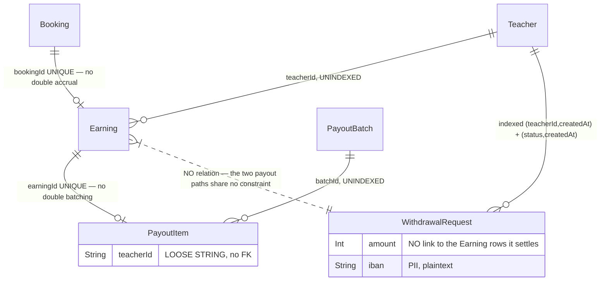

# Phase 2 — Schema: `payouts`

Models: `Earning`, `PayoutBatch`, `PayoutItem`, `WithdrawalRequest`.
Services: `earnings.service.ts`, `payouts.service.ts`.

This domain has **two parallel ways for a teacher to be paid** — weekly batches
(`PayoutBatch`/`PayoutItem`) and self-service withdrawals (`WithdrawalRequest`) — which is the
central structural question here.

## 2.1 Structure

### `Earning` (`schema.prisma:747-760`)

| Field | Type | Required | Default | Index | Notes |
| --- | --- | --- | --- | --- | --- |
| `teacherId` | String | ✅ | — | **none** | FK |
| `bookingId` | String | ✅ | — | **`@unique`** (:751) | **one earning per booking — DB-enforced** |
| `grossAmount` | Int | ✅ | — | none | toman |
| `commissionAmount` | Int | ✅ | — | none | platform cut |
| `netAmount` | Int | ✅ | — | none | `gross - commission`, **derived and stored**, no CHECK |
| `status` | EarningStatus | ✅ | `PENDING` | **none** | `PENDING\|ELIGIBLE\|HELD\|DISPUTED\|PAID` |
| `eligibleAt` | DateTime | ✅ | — | **none** | when the hold period ends |

`bookingId @unique` is the correct guard against double-accruing a teacher for one lesson — the
same DB-level pattern used well in `Review`. `earnings.accrue` is called inside the `complete()`
transaction (`bookings.service.ts:396`), so the constraint backs the invariant rather than merely
documenting it.

**`status` and `eligibleAt` are both unindexed**, yet the batch generator must query exactly
`status = ELIGIBLE AND eligibleAt <= now` to assemble a payout run. That is a full scan of the
earnings table on every payout generation. **F-281.**

### `PayoutBatch` (`schema.prisma:762-774`) / `PayoutItem` (`:776-784`)

`PayoutBatch`: `weekStart`, `weekEnd`, `status PayoutStatus` (`DRAFT|PENDING_APPROVAL|APPROVED|
TRANSFERRED|FAILED`), `totalAmount Int` (**denormalized sum of items**), `approvedById` (loose
string), `approvedAt`, `transferredAt`, `reference`. **No indexes**, including none on `weekStart`
or `status`.

`PayoutItem`: `batchId` (FK, **unindexed**), `earningId` **`@unique`** (:780) — so an earning can
belong to at most one batch, correctly preventing double payout — `teacherId` (**loose string, no
FK**), `amount`.

`PayoutBatch.totalAmount` is a stored aggregate of its items with no recomputation path visible in
the schema; whether every item write updates it is a Phase 4 question.

### `WithdrawalRequest` (`schema.prisma:786-808`)

| Field | Type | Required | Default | Index | Notes |
| --- | --- | --- | --- | --- | --- |
| `teacherId` | String | ✅ | — | `@@index([teacherId, createdAt])` (:806) | FK |
| `amount` | Int | ✅ | — | none | |
| `iban` | String | ✅ | — | none | **bank account number — PII, stored in plaintext** |
| `idempotencyKey` | String? | ❌ | — | **`@unique`** (:796) | nullable-unique; comment `:792-795` explains NULLs don't collide |
| `status` | WithdrawalStatus | ✅ | `PENDING` | `@@index([status, createdAt])` (:807) | `PENDING\|APPROVED\|TRANSFERRED\|REJECTED` |
| `reference`, `rejectionNote` | String? | ❌ | — | none | |
| `reviewedById` | String? | ❌ | — | none | loose string, no FK |
| `reviewedAt`, `transferredAt` | DateTime? | ❌ | — | none | |

This is the **best-indexed model in the schema** — both real query patterns (`teacher's own
history`, `admin queue by status`) have a covering composite index, and the nullable-unique
idempotency key is documented and correct. It is also the newest (migrations
`20260731090000` and `20260801120000`), which shows the schema's index discipline improved over
time.

`iban` in plaintext with no encryption is a PII finding carried to Phase 7.

### The two-path problem

`Earning.status` includes `PAID`, and `PayoutItem.earningId @unique` prevents an earning being
batched twice. But `WithdrawalRequest` records **an amount, not a set of earnings** — there is no
link from a withdrawal to the `Earning` rows it settles. Nothing in the schema prevents a teacher's
balance from being paid out once via a `PayoutBatch` and again via a `WithdrawalRequest`, because
the two paths share no constraint. Whether application code closes this is the single most
important Phase 6 question in this domain. **F-282** (schema-level observation; exploitability
assessed in Phase 6).

### Enums

`EarningStatus` (:93-99), `PayoutStatus` (:101-107), `WithdrawalStatus` (:109-114) — three separate
status enums with overlapping vocabulary (`APPROVED`, `TRANSFERRED`, `PAID`, `FAILED`).

## 2.2 Relationship diagram

## 2.3 Read/write profile

| Entity | Read by | Written by | Cardinality | Growth | Profile |
| --- | --- | --- | --- | --- | --- |
| `Earning` | `GET /teacher/finance`, `POST /payouts/generate` (**scan on `status`+`eligibleAt`**), admin reports | `earnings.accrue` inside `complete()` (`bookings.service.ts:396`); status transitions on batching | 1 per completed paid booking | linear with lessons | **append-mostly, scan-read** |
| `PayoutBatch` | `GET /payouts/withdrawals`, admin | `POST /payouts/generate`, `/:id/approve` | ~52/year | trivial | balanced |
| `PayoutItem` | batch detail | batch generation | = eligible earnings per run | linear | write-once |
| `WithdrawalRequest` | `GET /teacher/finance`, `GET /payouts/withdrawals` (admin queue) | `POST /teacher/finance/withdrawals`, `/payouts/withdrawals/:id/transfer` | low per teacher | linear | balanced, **well indexed** |

## Findings

| ID | Sev | Title | Evidence |
| --- | --- | --- | --- |
| F-281 | medium | `Earning.status` and `eligibleAt` are unindexed, so every payout generation scans the whole earnings table on exactly those two columns | `schema.prisma:747-760`; no `@@index` declared |
| F-282 | medium | Two independent payout paths (`PayoutBatch`/`PayoutItem` and `WithdrawalRequest`) share no schema-level constraint; a withdrawal records an amount with no link to the earnings it settles | `schema.prisma:776-784` vs `:786-808` |
| F-283 | medium | `PayoutBatch.totalAmount` is a stored denormalized sum of its items with no schema-level recomputation guarantee | `schema.prisma:767` |
| F-284 | low | `PayoutItem.teacherId`, `PayoutBatch.approvedById`, `WithdrawalRequest.reviewedById` are loose strings with no FK | `schema.prisma:782,768,800` |
| F-285 | low | `Earning.netAmount` stores `gross − commission` with no CHECK constraint | `schema.prisma:753-755` |
| F-286 | low | `WithdrawalRequest.iban` stores a bank account number in plaintext with no encryption (carried to Phase 7) | `schema.prisma:791` |
