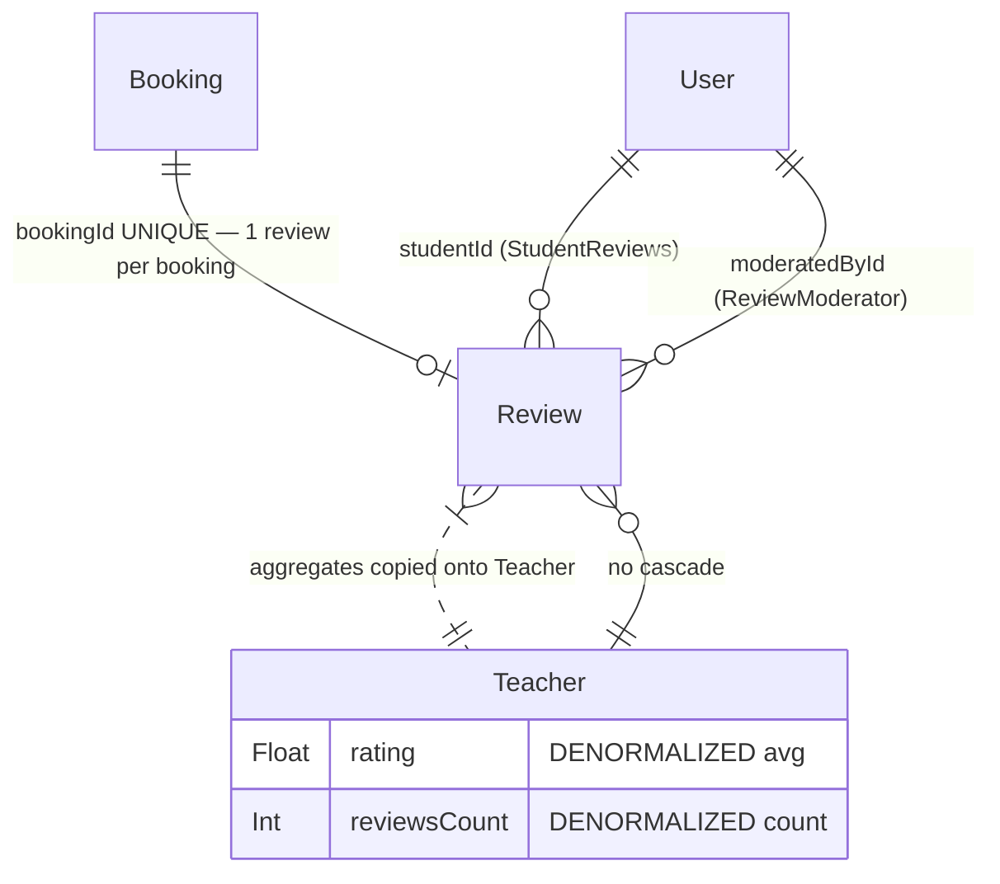

# Phase 2 — Schema: `reviews`

Models: `Review` (+ `Favorite`, documented in `02-schema-users.md` since it is written by
`UsersService`). Service: `modules/teachers/reviews.service.ts`.

## 2.1 Structure

### `Review` (`schema.prisma:372-394`)

| Field | Type | Required | Default | Index | Notes |
| --- | --- | --- | --- | --- | --- |
| `id` | String | ✅ | `cuid()` | PK | |
| `teacherId` | String | ✅ | — | `@@index([teacherId, moderationStatus, published])` (:393) | FK, **no cascade** |
| `studentId` | String | ✅ | — | **none** | FK `@relation("StudentReviews")` |
| `bookingId` | String | ✅ | — | **`@unique`** (:378) | **one review per booking — enforced by the DB** |
| `rating` | Int | ✅ | — | none | **no CHECK constraint on 1–5** |
| `comment` | String? | ❌ | — | none | free text, unbounded length |
| `moderationStatus` | ReviewStatus | ✅ | `PENDING` | ↑ composite | `PENDING\|APPROVED\|REJECTED\|NEEDS_REVISION` |
| `published` | Boolean | ✅ | `false` | ↑ composite | **second visibility flag alongside `moderationStatus`** |
| `moderatedById` | String? | ❌ | — | none | FK `@relation("ReviewModerator")` |
| `moderatedAt` | DateTime? | ❌ | — | none | |
| `rejectionReason` | String? | ❌ | — | none | |
| `teacherResponse` | String? | ❌ | — | none | **reply stored as a column, not a child row** |
| `respondedAt` | DateTime? | ❌ | — | none | |

Two design points worth stating plainly:

1. **`bookingId @unique` is the correct anti-duplicate guard.** A student cannot review the same
   lesson twice, and the constraint is in the database rather than in application code — the one
   place in this schema where that pattern is used well. Because `Booking` already carries
   `studentId` and `teacherId`, this also transitively prevents reviewing a teacher you never had
   a lesson with, *provided* the service checks booking ownership and status (verified in Phase 4).

2. **Visibility is modelled twice.** `moderationStatus = APPROVED` and `published = true` are
   independent columns with no constraint tying them together. `(APPROVED, published=false)` and
   `(REJECTED, published=true)` are both representable. The composite index at `:393` indexes all
   three columns precisely because both must be checked on every read. **F-231.**

3. **Teacher replies are a column pair (`teacherResponse`, `respondedAt`), not rows.** This caps
   the conversation at exactly one reply, forever, and gives the reply no independent moderation
   state — a teacher's reply is published the instant it is written, while the student's review had
   to pass moderation. **F-232.** Alternatives in Phase 3.

`rating Int` has no database CHECK. Prisma cannot express one; PostgreSQL can, via a raw migration.
Nothing prevents `rating: 1000` at the DB level, and `Teacher.rating` is an average of these
values. Validation must therefore be complete in the DTO — verified in Phase 4.

## 2.2 Relationship diagram

The dotted edge is the denormalization: `Teacher.rating` and `Teacher.reviewsCount`
(`schema.prisma:286-287`) are copies whose only correctness guarantee is that every code path that
changes a review's visibility recomputes them. The schema comment at `:369-371` documents that the
refresh filters on `(teacherId, moderationStatus, published)` — which is exactly what the index
serves. Whether **every** mutation path calls it is a Phase 4 question, and the highest-value one
in this domain.

## 2.3 Read/write profile

| Entity | Read by | Written by | Cardinality | Growth | Profile |
| --- | --- | --- | --- | --- | --- |
| `Review` | `GET /teachers/:slug` (public profile, embedded), `GET /admin/reviews`, rating refresh, one-star auto-deactivation check | `POST /reviews` (student), `POST /reviews/:id/reply` (teacher), `POST /admin/reviews/:id/moderate` | ≤ 1 per completed booking | linear with completed lessons | **read-heavy** (public profile) |
| `Teacher.rating` / `reviewsCount` | every directory and profile read | recomputed on moderation | — | — | **read ≫ write** — which is what justifies the denormalization |

Read amplification: `GET /teachers/:slug` returns `reviews` inline
(`apps/web/src/lib/api.ts:46` declares `reviews?:unknown[]` on `PublicTeacher`), so a teacher with
2,000 reviews produces a 2,000-element array on a public, uncached, unauthenticated endpoint unless
the service applies a `take`. Verified in Phase 4/5 — this is the classic unbounded-nested-array
hazard the brief asks about, and the profile endpoint is the place it would bite.

## Findings

| ID | Sev | Title | Evidence |
| --- | --- | --- | --- |
| F-231 | medium | Review visibility modelled by two independent columns (`moderationStatus`, `published`) with no constraint linking them; `(REJECTED, published=true)` is representable | `schema.prisma:382-383` |
| F-232 | low | Teacher replies are a `teacherResponse`/`respondedAt` column pair, capping replies at one and giving them no moderation state despite the student's review requiring approval | `schema.prisma:388-389` |
| F-233 | low | `Review.rating` has no CHECK constraint and no DB-level bound, yet feeds the denormalized `Teacher.rating` average | `schema.prisma:380`; `:286` |
| F-234 | low | `Review.studentId` is unindexed, so "my reviews" and per-student moderation lookups have no supporting index | `schema.prisma:376-377`, only index is `:393` |
