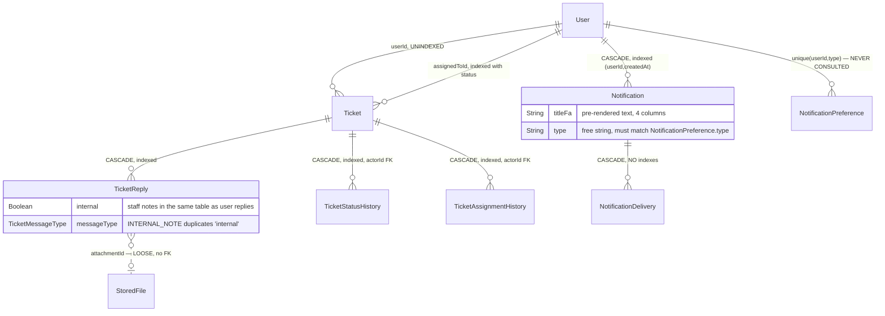

# Phase 2 — Schema: `support`

Models: `Ticket`, `TicketReply`, `TicketStatusHistory`, `TicketAssignmentHistory`,
`Notification`, `NotificationDelivery`. Service: `modules/support/support.service.ts`.

Two distinct concerns share this module: **ticketing** (well modelled, well indexed, with proper
audit trails) and **notifications** (the weakest part, per F-104/F-212).

## 2.1 Structure — ticketing

### `Ticket` (`schema.prisma:1097-1117`)

| Field | Type | Required | Default | Index | Notes |
| --- | --- | --- | --- | --- | --- |
| `userId` | String | ✅ | — | **none** | FK — reporter |
| `subject` | String | ✅ | — | none | |
| `category`, `priority` | String | ✅ | — | none | **free strings, no enums** |
| `status` | TicketStatus | ✅ | `OPEN` | `@@index([status, updatedAt])` (:1115) | 6 states |
| `assignedToId` | String? | ❌ | — | `@@index([assignedToId, status])` (:1116) | FK `@relation("TicketAssignee")` |
| `slaDueAt` | DateTime? | ❌ | — | **none** | **SLA deadline, unindexed** |
| `lastReplyAt` | DateTime? | ❌ | — | none | denormalized from replies |

Both indexes match real queries: the support queue (`status` + recency) and "my assigned tickets".
This is the best-indexed non-financial model in the schema.

`slaDueAt` unindexed is the gap: any "tickets breaching SLA" sweep scans the table. There is no
cron for it in the codebase (only the reconciliation cron exists, Phase 1 §1.3), so `slaDueAt` is
currently **written but never acted on**. **F-2C1.**

`category` and `priority` as free strings in a model that otherwise uses three purpose-built enums
(`TicketStatus`, `TicketDirection`, `TicketMessageType`) is inconsistent.

`lastReplyAt` is a denormalized copy of `MAX(TicketReply.createdAt)` whose update path must be
verified (Phase 4).

### `TicketReply` (`schema.prisma:1119-1137`)

`ticketId` (**cascade**), `authorId` FK, `authorRole Role` default `STUDENT`,
`direction TicketDirection` default `INBOUND`, `messageType TicketMessageType` default
`USER_MESSAGE`, `body String`, `attachmentId String?` (**loose string, no FK to `StoredFile`**),
`internal Boolean` default false. Index: `@@index([ticketId, createdAt])` (:1136) — correct.

The comment at `:1125-1127` explains the three defaults exist only to keep schema and migration in
agreement and that the service always sets them explicitly — honest and useful documentation.

**`internal Boolean` is the security-critical column here**: internal staff notes live in the same
table as user-visible replies, distinguished only by a boolean. Any read path for
`GET /support/tickets/:id` that forgets `where: { internal: false }` leaks staff notes to the
reporter. `messageType: INTERNAL_NOTE` encodes the same thing a second way — two representations of
one fact, so a filter on one but not the other is a live hazard. Verified in Phase 4/7. **F-2C2.**

`attachmentId` as a loose string with no FK to `StoredFile` is the same defect seen in
`User.avatarKey` and `Teacher.introVideoKey` — but here it is worse, because ticket attachments are
user-uploaded and the file's `ownerId`/`status` cannot be joined to check access.

### `TicketStatusHistory` (`:1194-1206`) / `TicketAssignmentHistory` (`:1208-1220`)

Both cascade from `Ticket`, both have `@@index([ticketId, createdAt])`, and both have **real FK
`actorId` → User** (`:1201`, `:1215`). These are the best-built audit tables in the schema —
compare `VerificationHistory` (F-223), which has neither an index nor an FK.

## 2.1b Structure — notifications

### `Notification` (`schema.prisma:1042-1058`)

| Field | Type | Required | Index | Notes |
| --- | --- | --- | --- | --- |
| `userId` | String | ✅ | `@@index([userId, createdAt])` (:1057) | **cascade** |
| `type` | String | ✅ | **none** | **free string** — must match `NotificationPreference.type` |
| `titleFa/En`, `bodyFa/En` | String | ✅ | none | **rendered text stored per row** |
| `data` | Json? | ❌ | none | payload (`bookingId`, `href`, …) |
| `readAt` | DateTime? | ❌ | **none** | unread counts filter on this |
| `idempotencyKey` | String? | ❌ | **`@unique`** (:1055) | added by migration `20260727120000` |

**Both title and body are stored pre-rendered in two languages on every row.** A user with 5,000
notifications carries 20,000 duplicated strings. Worse, the text is frozen at send time, so a
copy fix never reaches sent notifications, and adding a third locale requires a schema change plus
a backfill. Contrast `LocalizedContent` (`:1259-1272`), which exists in this very schema precisely
to avoid that pattern. **F-2C3.**

`readAt` is unindexed although the unread badge is the single most frequent notification query.

`idempotencyKey` is nullable-unique and **used only by the reminder worker**
(`queue.service.ts:56-58`); the five in-app notification sites in `bookings.service.ts` and
`payments.service.ts` leave it null (F-104).

### `NotificationDelivery` (`schema.prisma:1060-1072`)

`notificationId` (**cascade**), `channel NotificationChannel` (`IN_APP|SMS`), `status String`
(**free string** — `'sent'`/`'failed'`/`'sending'`), `attempts Int`, `providerId String?`,
`providerResponse Json?`, `scheduledAt?`, `sentAt?`. **No indexes at all**, though
`GET /admin/notification-deliveries` reads exactly this table.

`providerResponse Json?` stores the raw Kavenegar response (`queue.service.ts:68`), which for the
verify/lookup API includes the recipient phone number — a PII-in-logs concern carried to Phase 7.

## 2.2 Relationship diagram

## 2.3 Read/write profile

| Entity | Read by | Written by | Cardinality | Growth | Profile |
| --- | --- | --- | --- | --- | --- |
| `Ticket` | `GET /support/tickets`, `/:id`, `GET /admin/tickets` | `POST /support/tickets`, status/assignment PATCHes | low per user | linear | balanced |
| `TicketReply` | ticket detail | `POST /support/tickets/:id/replies` | ~5 per ticket | linear | balanced |
| `TicketStatusHistory`/`AssignmentHistory` | ticket detail | every transition | ~5 per ticket | append-only | write-once |
| `Notification` | `GET /notifications` (**every page load, for the badge**) | **5 domains** (F-104) | **highest-volume table in the domain** | linear with all activity | **write-heavy, read-amplified** |
| `NotificationDelivery` | `GET /admin/notification-deliveries` | reminder worker per recipient per channel | ~2 per notification | 2× notifications | **write-heavy, never pruned** |

`Notification` is written by `bookings.service.ts:267,319,351,397`, `payments.service.ts:303`,
`queue.service.ts:58`, `auth/sms.service.ts` and `support.service.ts` — seven call sites across
five domains, with no owning service (F-104). It is read on every authenticated page load via
`GET /notifications` and filtered by `readAt`, which has no index.

Neither `Notification` nor `NotificationDelivery` has a retention policy.

## Findings

| ID | Sev | Title | Evidence |
| --- | --- | --- | --- |
| F-2C1 | low | `Ticket.slaDueAt` is written but unindexed and no job ever acts on it — the SLA is recorded, not enforced | `schema.prisma:1107`; only cron is `reconciliation.service.ts:63` |
| F-2C2 | medium | Internal staff notes share `TicketReply` with user-visible replies, flagged two independent ways (`internal` Boolean and `messageType = INTERNAL_NOTE`); a read path filtering one but not the other leaks staff notes | `schema.prisma:1130,1133` |
| F-2C3 | medium | `Notification` stores pre-rendered `titleFa/titleEn/bodyFa/bodyEn` per row — 4 duplicated strings per notification, frozen at send time, with `LocalizedContent` already existing in the same schema for this purpose | `schema.prisma:1047-1050` vs `:1259-1272` |
| F-2C4 | medium | `Notification.readAt` unindexed despite the unread badge querying it on every page load; `NotificationDelivery` has no indexes at all | `schema.prisma:1052,1060-1072` |
| F-2C5 | low | `TicketReply.attachmentId` is a loose string with no FK to `StoredFile`, so attachment ownership and scan status cannot be joined | `schema.prisma:1132` |
| F-2C6 | low | `Ticket.category` and `priority` are free strings in a model that otherwise defines three purpose-built enums | `schema.prisma:1102-1103` |
