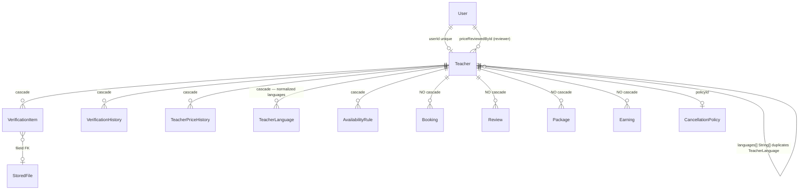

# Phase 2 — Schema: `teachers`

Models: `Teacher`, `VerificationItem`, `VerificationHistory`, `TeacherPriceHistory`.
Services: `teachers.service.ts`, `verification.service.ts`, `pricing.service.ts`.

`Teacher` is the widest model in the schema (56 fields) and the busiest public read. It carries
three distinct concerns in one table: profile, **price-approval workflow**, and denormalized
rating aggregates.

## 2.1 Structure

### `Teacher` (`schema.prisma:276-339`)

**Identity / profile**

| Field | Type | Required | Default | Index | Notes |
| --- | --- | --- | --- | --- | --- |
| `id` | String | ✅ | `cuid()` | PK | |
| `userId` | String | ✅ | — | **`@unique`** (:278) | 1:1 with User |
| `slug` | String | ✅ | — | **`@unique`** (:280) | public URL key; `GET /teachers/:slug` |
| `nameFa`/`nameEn` | String | ✅ | — | none | **fa/en as columns, not rows** |
| `bioFa`/`bioEn` | String | ✅ | — | none | ↑ same |
| `status` | TeacherStatus | ✅ | `DRAFT` | `@@index([status, approvedAt])`, `@@index([status, rating])` (:337-338) | 7-state workflow |
| `gender` | String? | ❌ | — | none | free string; matching filters on it |
| `experienceYears` | Int | ✅ | `0` | none | |
| `specialties` | String[] | ✅ | — | **none** | Postgres array, no GIN index |
| `languages` | String[] | ✅ | — | **none** | ↑ duplicates `TeacherLanguage` (see below) |
| `targetBands` | Float[] | ✅ | — | **none** | ↑ |
| `introVideoKey` | String? | ❌ | — | none | loose S3 key, no FK |
| `policyId` | String? | ❌ | — | none | → `CancellationPolicy` |

**Denormalized aggregates**

| Field | Type | Default | Notes |
| --- | --- | --- | --- |
| `rating` | Float | `0` | **denormalized copy** of AVG(Review.rating) |
| `reviewsCount` | Int | `0` | **denormalized copy** of COUNT(Review) |

Both are indexed as `@@index([status, rating])` (:338), which is what makes the "sort by rating"
directory query cheap. Their refresh path is assessed in Phase 4 — the schema comment at
`:369-371` states the rating refresh filters on `(teacherId, moderationStatus, published)`.

**Price-approval workflow — 11 columns**

| Field | Type | Notes |
| --- | --- | --- |
| `trialPrice`, `regularPrice` | Int, default 0 | **live/legacy** prices |
| `proposedTrialPrice`, `proposedRegularPrice` | Int? | teacher's proposal |
| `approvedTrialPrice`, `approvedRegularPrice` | Int? | **the only prices bookings may use** |
| `counterTrialPrice`, `counterRegularPrice` | Int? | admin counter-offer |
| `priceStatus` | PriceStatus | `DRAFT\|SUBMITTED\|UNDER_REVIEW\|COUNTER_OFFER\|APPROVED\|REJECTED` |
| `priceReviewedById` → User | String? | `@relation("TeacherPriceReviewer")` |
| `priceReviewedAt`, `priceReviewNote` | DateTime?/String? | |

**Six price columns for two prices** is the single most consequential shape decision in this
domain. `bookings.service.ts:90` reads `approvedTrialPrice`/`approvedRegularPrice` and refuses to
book when null (`:91`); `trialPrice`/`regularPrice` are the pre-workflow originals and are the
trap — anything reading them gets an unapproved figure. Assessed in Phase 3/4.

`trialDuration` (default 30) and `lessonDuration` (default 60) drive slot generation;
`breakMinutes` defaults to `0` with a comment (`:294-296`) recording that a mandatory 10-minute
buffer was deliberately reversed.

### `VerificationItem` (`schema.prisma:341-356`)

| Field | Type | Required | Index | Notes |
| --- | --- | --- | --- | --- |
| `teacherId` | String | ✅ | **none** | `onDelete: Cascade` |
| `kind` | String | ✅ | none | free string — document type is unconstrained |
| `status` | DocumentStatus | ✅ | none | `DRAFT\|SUBMITTED\|UNDER_REVIEW\|APPROVED\|REJECTED\|NEEDS_REVISION` |
| `fileId` → StoredFile | String? | ❌ | none | **proper FK** (contrast `avatarKey`) |
| `reviewedById` | String? | ❌ | none | **not a FK** — loose string, unlike `Teacher.priceReviewedById` |

**No index on `teacherId`** despite it being the only way this table is ever queried. Phase 5.

### `VerificationHistory` (`schema.prisma:358-367`) and `TeacherPriceHistory` (`:1173-1192`)

Append-only audit trails. `TeacherPriceHistory` has `@@index([teacherId, createdAt])` (:1191);
`VerificationHistory` has **no index at all** and its `actorId` (:364) is a loose string, whereas
`TeacherPriceHistory.actorId` is a real FK (`:1178`). The two audit tables were clearly written at
different times to different standards.

### Enums

`TeacherStatus` (:26-34): `DRAFT|SUBMITTED|DOCUMENT_REVIEW|INTERVIEW|DEMO_REVIEW|APPROVED|REJECTED`.
`PriceStatus` (:147-154), `DocumentStatus` (:138-145) — note `DocumentStatus` and `ReviewStatus`
(:36-41) overlap heavily but are separate enums.

## 2.2 Relationship diagram

Cascade behaviour is **split**: profile-satellite tables cascade, while everything with financial
or historical meaning (`Booking`, `Review`, `Package`, `Earning`) does not. That is the right
instinct — but it means `teacher.delete()` will simply fail on an FK violation rather than
soft-delete. There is no `Teacher.status = DELETED` equivalent; `TeacherStatus` has no deleted
state. Phase 6.

### Duplicate language storage

`Teacher.languages String[]` (`:310`) and the `TeacherLanguage` join table (`:1159-1171`) both
model "which languages this teacher teaches". Two sources of truth with no synchronising
constraint. `PublicTeacher` on the frontend carries **both** (`apps/web/src/lib/api.ts:46`:
`languages:string[]` *and* `languageLinks?:TeacherLanguage[]`), so the drift is visible in the
API contract. **F-221.**

## 2.3 Read/write profile

| Entity | Read by | Written by | Cardinality | Growth | Profile |
| --- | --- | --- | --- | --- | --- |
| `Teacher` | `GET /teachers` (public directory — **busiest read on the site**), `GET /teachers/:slug`, `GET /availability/:teacherId/slots`, matching, search, every booking/payout join | `POST`/`PATCH /teacher/application`, `POST /teacher/application/submit`, `POST /admin/teacher-applications/:id/transition`, `POST /admin/teacher-prices/:id/review`, `POST /teacher/pricing/*`, plus **rating/reviewsCount refresh on review moderation** | hundreds–thousands | slow | **overwhelmingly read-heavy** |
| `VerificationItem` | `GET /admin/teacher-applications`, teacher panel | `verification.service.ts` on upload/review | ~5 per teacher | slow | balanced |
| `VerificationHistory` | admin detail view | every status transition | ~10 per teacher | slow, append-only | **write-once** |
| `TeacherPriceHistory` | `GET /teacher/pricing`, `GET /admin/teacher-prices` | every propose/review/counter/accept | ~10 per teacher | slow, append-only | **write-once** |

The directory read (`GET /teachers`, public, paginated `limit ≤ 50` at
`teachers.controller.ts:23`) filters `status = APPROVED` and sorts by `approvedAt` or `rating` —
exactly what `@@index([status, approvedAt])` and `@@index([status, rating])` serve. Those two
indexes are correctly chosen and were added deliberately (comment `:334-336`).

Filters offered by that endpoint that **no index serves**: `search`, `skill`, `language`,
`minBand`, `maxPrice` (`teachers.controller.ts:14-19`). `specialties`, `languages`, `targetBands`
are un-indexed `String[]`/`Float[]` columns. Cost assessed in Phase 5.

## Findings

| ID | Sev | Title | Evidence |
| --- | --- | --- | --- |
| F-221 | medium | Teacher languages stored twice — `Teacher.languages String[]` and the `TeacherLanguage` join table — with no synchronising constraint; both are exposed in the API contract | `schema.prisma:310` vs `:1159-1171`; `apps/web/src/lib/api.ts:46` |
| F-222 | medium | `VerificationItem` has no index on `teacherId`, its only query key | `schema.prisma:341-356` |
| F-223 | low | `VerificationHistory` has no index and its `actorId` is a loose string, while the sibling `TeacherPriceHistory` has both an index and a real FK | `schema.prisma:358-367` vs `:1173-1192` |
| F-224 | low | Six price columns plus two legacy `trialPrice`/`regularPrice` columns model two prices; the legacy pair holds unapproved values and is a live footgun | `schema.prisma:290-304`; `bookings.service.ts:90` |
| F-225 | low | `Teacher.introVideoKey` is a loose S3 key with no FK to `StoredFile` | `schema.prisma:312` |
