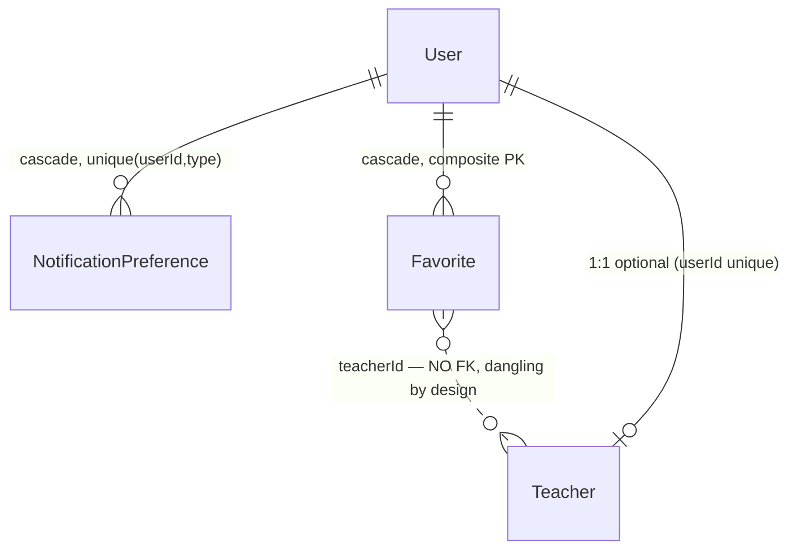

# Phase 2 — Schema: `users`

Models: `User` (profile columns), `NotificationPreference`. Service: `modules/users/users.service.ts`.
`User` is shared with `auth-identity`; only the profile-facing columns are documented here.

## 2.1 Structure

### `User` — profile columns (`schema.prisma:177-217`)

| Field | Type | Required | Default | Index | Notes |
| --- | --- | --- | --- | --- | --- |
| `name` | String? | ❌ | — | none | single field; no given/family split |
| `email` | String? | ❌ | — | none | not unique (F-202) |
| `avatarKey` | String? | ❌ | — | none | S3 object key; **no FK to `StoredFile`** — a loose string |
| `birthDate` | DateTime? | ❌ | — | **none** | date-only by convention; the comment at `:183-185` states the time component is never read |
| `locale` | String | ✅ | `"fa"` | none | free string, not constrained to `fa\|en` |
| `timezone` | String | ✅ | `"Asia/Tehran"` | none | free IANA string, unvalidated at the column level |
| `profileComplete` | Boolean | ✅ | `false` | none | **denormalized** — derived from other columns, stored |
| `status` | UserStatus | ✅ | `ACTIVE` | none | soft delete |

`birthDate` is the input to the automatic birthday discount
(`commerce/discounts/auto-discounts.service.ts`), which compares month/day only. It is unindexed;
the rule is evaluated per checkout for the current user, so no scan is implied — see Phase 5.

### `NotificationPreference` (`schema.prisma:1074-1083`)

| Field | Type | Required | Default | Index |
| --- | --- | --- | --- | --- |
| `id` | String | ✅ | `cuid()` | PK |
| `userId` | String | ✅ | — | part of `@@unique([userId, type])` (:1082); `onDelete: Cascade` |
| `type` | String | ✅ | — | ↑ — **free string, not an enum** |
| `inApp` | Boolean | ✅ | `true` | — |
| `sms` | Boolean | ✅ | `true` | — |

`type` being an unconstrained `String` rather than an enum is the root of a real defect: nothing
guarantees the `type` a preference row stores matches the `type` a notification is created with.
`Notification.type` (`schema.prisma:1046`) is likewise a free `String`. See F-104 (Phase 1) and
Phase 4.

### `Favorite` (`schema.prisma:396-403`) — owned here by usage, listed under `reviews` by module layout

| Field | Type | Required | Index | Notes |
| --- | --- | --- | --- | --- |
| `userId` | String | ✅ | **composite `@@id([userId, teacherId])`** (:402) | cascades from User |
| `teacherId` | String | ✅ | ↑ | **no relation declared to `Teacher`** — see below |
| `createdAt` | DateTime | ✅ | none | |

`Favorite.teacherId` has **no `@relation`** (`schema.prisma:398`) — unlike `userId` at `:399`.
It is a bare string column with no foreign key, so PostgreSQL will not reject a favorite pointing
at a non-existent teacher, and deleting a teacher leaves the row behind. `User.favorites` exists
(`:200`) but `Teacher` has no inverse `favorites` field. **F-211.**

## 2.2 Relationship diagram

`Favorite → Teacher` is drawn dotted because it is a **denormalized id copy with no referential
integrity**, not a modelled relation.

## 2.3 Read/write profile

| Entity | Read by | Written by | Cardinality | Growth | Profile |
| --- | --- | --- | --- | --- | --- |
| `User` (profile) | `GET /users/me`, `GET /admin/users`, `GET /admin/users/:id`, `GET /search/:entity`, every teacher/booking join | `PUT /users/me`, `PUT /users/me/locale`, `POST /auth/otp/request` (upsert on first login, `auth.service.ts:26`) | 1 per human | linear with signups | **read-heavy** |
| `NotificationPreference` | **almost nothing** — see below | `PUT /users/me`? (verify in Phase 4) | ≤ types × users | flat | effectively **write-only** |
| `Favorite` | `GET /users/me/favorites` | `PUT`/`DELETE /users/me/favorites/:teacherId` | low, per user | linear | balanced |

### `NotificationPreference` is written but never consulted

The model exists, has a unique key, and defaults both channels to `true`, but the notification
creation sites do not read it. `bookings.service.ts:267,319,351,397` and `payments.service.ts:303`
create `Notification` rows directly with no preference lookup; `queue.service.ts:58` does the same
for reminders and then sends SMS at `:65` gated only on `KAVENEGAR_API_KEY`, not on
`preference.sms`.

Only `support.service.ts` references `notificationPreference` at all (per the Phase 1 model-access
matrix). So a user who turns SMS off still receives reminder SMS. This is the "field written but
never read" case the brief asks for, and it is a **functional** defect rather than a hygiene one.
**F-212**, severity medium; confirmed against the send path in Phase 4.

## Findings

| ID | Sev | Title | Evidence |
| --- | --- | --- | --- |
| F-211 | medium | `Favorite.teacherId` has no foreign key or relation — favorites can point at deleted/non-existent teachers and are never cascaded | `schema.prisma:396-403` (`userId` has `@relation` at :399, `teacherId` has none at :398) |
| F-212 | medium | `NotificationPreference` is never consulted by the notification/SMS send paths; disabling a channel has no effect | `schema.prisma:1074-1083`; `queue.service.ts:58,65`; `bookings.service.ts:267` |
| F-213 | low | `User.avatarKey` is a loose S3 key string with no FK to `StoredFile`, so avatar objects are untracked by the file lifecycle | `schema.prisma:182` vs `StoredFile` `:1025-1040` |
| F-214 | low | `User.locale` and `User.timezone` are unconstrained strings; the DB accepts any value despite `localeSchema` existing in contracts | `schema.prisma:187-188`; `packages/contracts/src/index.ts:3` |
